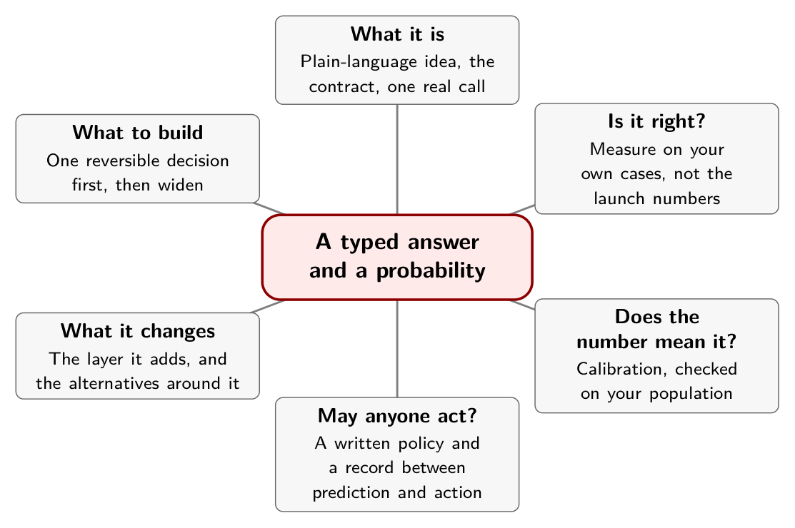
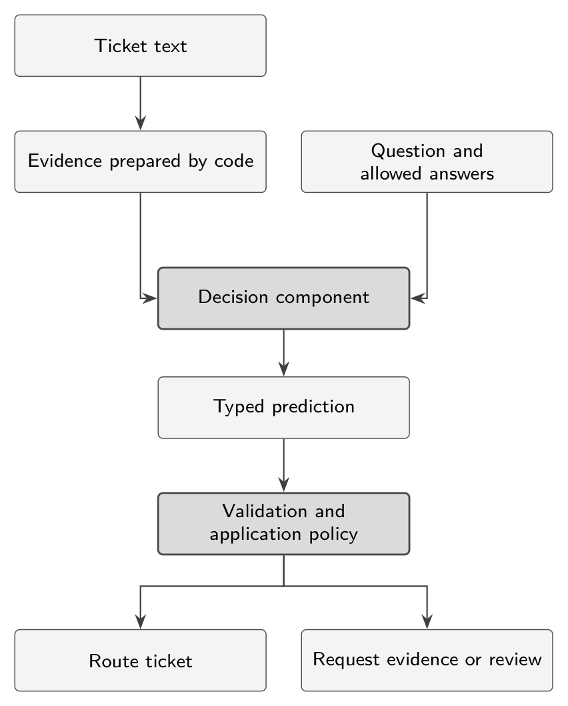
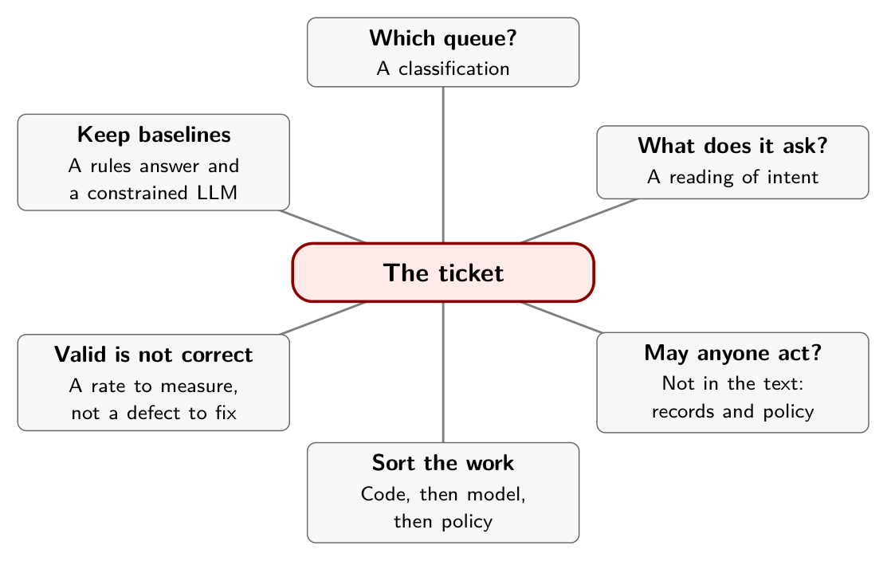

# Chapter 1. The Ticket That Isn't One Question

An application receives a message from a customer: *"My invoice contains the same charge twice. Please refund the duplicate."*

The obvious move is to hand the message to a model and take whatever comes back. Look first at what the software has to settle before anything useful happens. Which queue owns the ticket? Is the customer asking for a refund, or only reporting a charge? And if a refund was asked for, may anyone issue it, on what evidence, under whose authority?

Those are three questions with three kinds of answer. The first is a classification. The second is a reading of intent. The third is not about the message at all. Its answer lives in the payment records, in whether the account has been verified, and in a policy somebody wrote and can be held to. A model can help with the first two. It cannot supply the third, because the third is not in the text, and a system that lets a probability stand in for it no longer has a policy.

A decision model gives your software a typed answer and a probability. Neither one tells you that the answer is correct, that the probability means what you think it means, or that anyone was entitled to act on it. Closing those three gaps is most of the work, and keeping the three questions above apart is how it starts.

This book is for people who write or review software that acts on a model's output. You do not need a machine-learning background, only enough comfort to read a short Python example. It is not a product manual, because the API will change, and it is not a benchmark: the measurements in it are other people's, attributed, and Appendix A says which were checked.

## The whole book on one page

The map below is the book in six branches. Each chapter ends with a smaller one of its own, so you can check what you kept before moving on. Chapter 2 explains the idea in plain language and needs no background.

{alt="Mindmap. Center: A typed answer and a probability. Branches: What it is (Plain-language idea, the contract, one real call); Is it right? (Measure on your own cases, not the launch numbers); Does the number mean it? (Calibration, checked on your population); May anyone act? (A written policy and a record between prediction and action); What it changes (The layer it adds, and the alternatives around it); What to build (One reversible decision first, then widen)."}

## What a decision model is

For the purposes of this book, a *decision model* is a component that takes evidence and a defined question, then evaluates a permitted list of answers. That is a functional definition. It says nothing about architecture or training, and it does not claim that every system that fits it works the same way. Chapter 2 explains the idea in plain language. Chapter 3 looks at one such model, Jev, in detail, and Chapter 8 looks at several others.

A useful application contract has three parts: the evidence, the question, and the allowed answers.

```json
{
  "state": {"message": "My invoice contains the same charge twice."},
  "question": "Which team should handle this?",
  "options": ["billing", "technical", "other"]
}
```

This is a conceptual contract, not the schema of any particular API. A hypothetical result might assign 0.90 to billing and 0.05 each to technical and other. Nothing in that result establishes that the charge was duplicated in the payment database. The customer has reported a problem; the application still has to investigate it.

{alt="Flow diagram. Ticket text becomes evidence prepared by code. The question and allowed answers join it as input to a decision component, which returns a typed prediction. The prediction passes through validation and application policy, which either routes the ticket or requests evidence or review."}

## Sort the work before you choose a model

Not every question that touches a ticket needs a model, and the ones that do need different things.

| Question | Where to start |
|---|---|
| Does the invoice total equal the sum of its line items? | Exact arithmetic in code |
| Does this message ask for a refund? | A semantic classifier or decision model |
| Which of our permitted queues fits best? | A rules baseline, then a decision model |
| What should a helpful reply say? | A template or a generative model |
| May this account receive money? | Verified business facts and an authorization policy, with any learned judgment kept explicit |

The vendor's own documentation draws the same line. It advises keeping arithmetic, date comparison and record lookups in code, and telling the model only what it needs.[^ch1-1]

An LLM asked to return a constrained JSON label is a legitimate comparison baseline, and so is a page of rules. Do not compare a carefully engineered decision API only against a deliberately fragile "please respond with valid JSON" prompt. Measure the alternatives you would actually deploy.

## Valid is not correct

TypeSafe describes Jev's output as impossible to malform, because the answer space is defined before the call. It is careful about what that figure is: a zero percent type-error rate that is "not empirical", guaranteed by schema matching rather than measured.[^ch1-2] A widely read launch-week guide repeats the caveat in its FAQ in one line: "Zero type errors is not zero mistakes."[^ch1-3]

Hold on to the distinction, because the rest of the book leans on it. A model that returned a string outside your options would be violating its contract, and you could test for that in an afternoon. A model that answered "billing" when the ticket belonged to technical support is doing what every classifier does. The first is a defect you fix once. The second is a rate you have to measure, on your own tickets, for as long as the system runs.

## In practice

- Write the three questions for your own decision before you name a model. For each, say whether the answer is in the text, in your records, or in a policy.
- Give the model only the first kind of question. Answer the others from records and rules.
- Keep at least two baselines: a rules or majority-class answer, and a constrained LLM you would really deploy.
- Treat "the output is always valid" as a statement about parsing. It says nothing about whether the answer is right.

## Remember this

One message hides three questions, and only the first two are for the model.

{alt="Mindmap. Center: The ticket. Branches: Which queue? (A classification); What does it ask? (A reading of intent); May anyone act? (Not in the text: records and policy); Sort the work (Code, then model, then policy); Valid is not correct (A rate to measure, not a defect to fix); Keep baselines (A rules answer and a constrained LLM)."}

[^ch1-1]: TypeSafe AI, "Jev 1.13 jaggedness," documentation, reviewed September 17, 2026, <https://docs.typesafe.ai/model-jaggedness/jev-1.13.md>. The page recommends keeping arithmetic in code, extracting date components and comparing them in code, and filtering state so it holds only what the question needs.

[^ch1-2]: Diogo Almeida, "Introducing System One Models & Jev," TypeSafe AI, September 15, 2026, <https://typesafe.ai/blog/introducing-system-one-models-and-jev>. Under "Hallucination and Type-safety," the post says of its 0 percent figure: "Our number is not empirical. Schema matching is guaranteed."

[^ch1-3]: unicodeveloper, "The Ultimate Guide to Jev: The new Frontier AI for faster decisions," Medium, September 17, 2026 (supplied copy, page 20; the original web address was not preserved). The FAQ answers "Can Jev hallucinate?" with: "It can still return the wrong valid value. Zero type errors is not zero mistakes."
