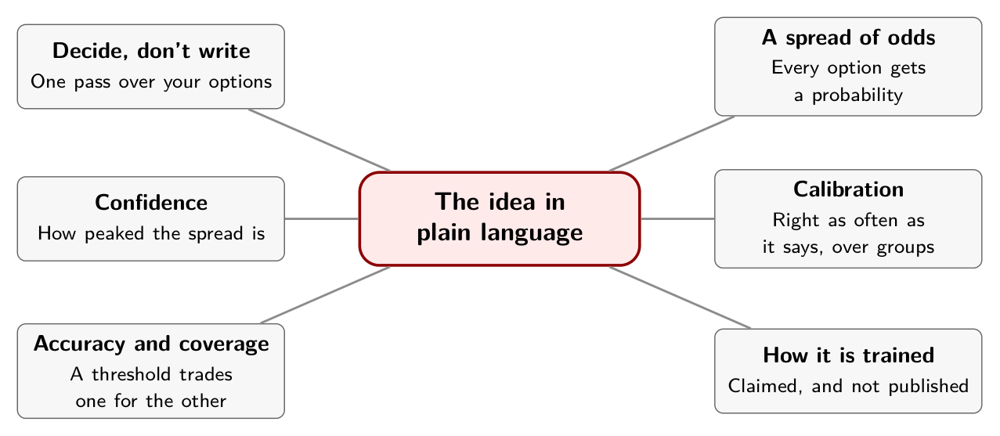

# Chapter 2. The Idea in Plain Language

Picture a very fast clerk at a support desk. A tray of ten tickets sits in front of them. The clerk never writes a reply and never issues a refund. For each ticket they read it, point at one of three trays (billing, technical or other), and say how sure they are.

That clerk is the whole idea of a decision model. Everything else in this book is about how much to trust the pointing, and how much to trust the "how sure."

## Deciding is not writing

A chat model answers by writing, one word at a time, each word conditioned on the ones before it. If you want a queue name out of it, you ask for JSON and write code to parse what comes back. Sometimes it arrives wrapped in a sentence, or spelled differently than your list.

A decision model is handed your list of allowed answers up front and scores all of them at once. The answer can only be one of your options, because those are the only things it is asked to score. TypeSafe says its model does not generate an answer step by step. It "scores the available choices in a single pass and returns their probabilities together."[^ch2-1]

Think of the difference between writing an essay answer and ticking a box. The box has no room for the wrong kind of answer. It still has room for the wrong box.

How the scoring happens inside is a separate question. For one open model, Laya, it is documented: an encoder reads the input and scores markers for each option. The same source is careful to add that this "does not mean Jev uses the same architecture," and TypeSafe has not published Jev's.[^ch2-2] So the picture here is the idea, not a diagram of Jev's insides.

## A spread of odds, not a verdict

The model does not just say "billing." It puts a share of belief on each option, and the shares add up to one. For one ticket the spread might be 0.90 on billing, 0.06 on technical and 0.04 on other. The option with the most weight is the model's answer.

The spread carries more than the answer does. Two tickets can both come back "billing" with very different spreads: one with nearly everything on billing, another with half on billing and half on technical. The first is a firm call. The second is a coin flip that happened to land on billing.

Systems give that difference a single name, *confidence*: a number for how peaked the spread is. TypeSafe's documentation puts it plainly. Concentrated on one outcome means a confident answer, spread out means an uncertain one.[^ch2-3] Chapter 4 covers why the definition matters and differs between systems.

## Are the odds honest?

A weather forecaster who says "90 percent chance of rain" is not claiming it will rain today. They are making a promise about many days: of all the days they said 90 percent, it should have rained on about nine in ten. If it rained on half of them, they are overconfident, however sure they sounded.[^ch2-4]

That promise is called *calibration*, and it can only be checked over a group, never one answer. It is the same for the clerk. Here is a tray of ten tickets, made up for this chapter, with what the clerk said and whether they were right.

| Ticket | The clerk points at | How sure | Right? |
|---|---|---|---|
| 1 | Billing | 0.97 | Yes |
| 2 | Billing | 0.95 | Yes |
| 3 | Technical | 0.93 | Yes |
| 4 | Technical | 0.92 | Yes |
| 5 | Billing | 0.90 | No |
| 6 | Technical | 0.75 | Yes |
| 7 | Other | 0.70 | Yes |
| 8 | Billing | 0.65 | No |
| 9 | Technical | 0.60 | Yes |
| 10 | Other | 0.55 | No |

*Ten invented tickets. The real experiments come in Chapter 6.*

Split the tray in two. The five tickets where the clerk said 0.90 or more averaged about 0.93, and they were right four times out of five, which is 80 percent. Slightly overconfident. The five below 0.90 averaged 0.65 and were right three times out of five, or 60 percent. That is close to honest.

Five tickets prove nothing. A real test needs hundreds, because a small group can wander from its true rate by luck. The tray is here to show what you are counting, not to show a result.

## Accuracy, coverage and the threshold

Overall the clerk was right on seven of ten tickets: 70 percent accuracy. Now suppose you let the clerk act alone only when they are at least 0.90 sure and send everything else to a person. That rule is a *threshold*.

Under it, five of ten tickets go through without a person. That share is the *coverage*: 50 percent. And those five are right 80 percent of the time, better than the 70 percent overall. That is the whole benefit of a threshold. You automate the cases where the clerk is most sure, and accuracy on those goes up.

It has two costs. Half the tickets still need a person. And one of the five automated tickets, number 5, was a confident mistake. A threshold raises the average. It does not remove the wrong answers hiding inside the confident group. Chapter 10 returns to that.

## Where the odds come from

Why should anyone believe the "how sure"? It depends on how the model was taught. There are three broad ways, and it helps to think of a student.

- **Rewarded for pleasing the teacher.** This is RLHF, the training behind chat models: humans pick the answers they prefer. TypeSafe's argument is that this can reward sounding confident.
- **Rewarded for right answers.** This is RLVR, used for reasoning models: an answer that can be checked automatically, such as a math result, earns the reward.
- **Rewarded for saying honestly how sure it is.** This is RLCD, TypeSafe's name for training a model to return decisions with probabilities that come true at the stated rate.[^ch2-5]

The third is a claim from the vendor. TypeSafe has published no technical paper on its recipe, and I found nothing independent that reproduces it.[^ch2-2b] That is why the rest of the book measures the "how sure" and does not take it on trust.

## What stays unknown

Jev's size, training data and architecture are not public. Everything in this chapter is a general idea that holds for the whole family of decision models. The Jev-specific facts in the chapters that follow come from TypeSafe's documentation and from other people's tests, and each one says which.

## In practice

- Ask three questions of any decision model. Is its answer always one of my options? How peaked is its spread on the cases that matter? Has anyone checked its "how sure" on tickets like mine?
- Keep your own tray. Count accuracy, and count accuracy and coverage at a threshold.
- Never judge a probability on ten cases. Use hundreds.

## Remember this

The model does not write an answer. It scores your options, and you decide what to do with the scores.

::: {.center}

{alt="Mindmap. Center: The idea in plain language. Branches: Decide, don't write (One pass over your options); A spread of odds (Every option gets a probability); Confidence (How peaked the spread is); Calibration (Right as often as it says, over groups); Accuracy and coverage (A threshold trades one for the other); How it is trained (Claimed, and not published)."}

:::

[^ch2-1]: Nhu Hoang, "Jev vs. LLMs: When AI Moves from Generation to Decision-Making," Towards Data Science, September 25, 2026, <https://towardsdatascience.com/jev-vs-llms-when-ai-moves-from-generation-to-decision-making/>, section 4 (supplied copy, page 7). The article says an LLM "predicts one token at a time" and that Jev, "according to TypeSafe, does not generate an answer this way. It scores the available choices in a single pass and returns their probabilities together."

[^ch2-2]: Hoang, "Jev vs. LLMs," section 4 (page 8): Laya "uses a ModernBERT encoder, which reads the input rather than generating text, and scores markers representing the available answer choices." The article adds that "it does not mean Jev uses the same architecture," and that TypeSafe "has not published its model size, training data, or full architecture."

[^ch2-3]: TypeSafe AI, "Confidence," documentation, <https://docs.typesafe.ai/confidence.md>: "concentrated on one outcome means a confident answer, spread out means an uncertain one."

[^ch2-4]: Hoang, "Jev vs. LLMs," section 6 (page 11), which uses the weather-forecaster analogy for calibration. The ten-ticket tray is my own invention, not from any source.

[^ch2-5]: TypeSafe AI, "AI primer," documentation, <https://docs.typesafe.ai/introduction/machine-learning-primer.md>. It describes RLHF as training models "to produce responses people prefer," RLVR as creating "reasoning models that are strong at tasks such as mathematics," and RLCD as training the model "to return decisions and calibrated probabilities instead of generated text." It also says RLHF "can also reward sycophancy and confident-sounding hallucinations."

[^ch2-2b]: Hoang, "Jev vs. LLMs," reference list (supplied copy, page 24): "TypeSafe has published documentation and a launch post for Jev, but no technical paper describing its architecture."
