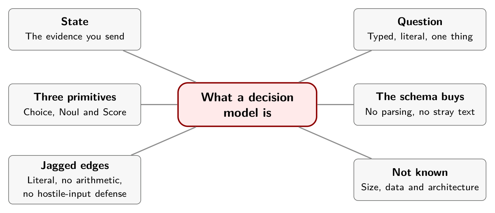

# Chapter 3. What a Decision Model Is, and Isn't

On September 15, 2026, a founder who had worked on the methods behind ChatGPT announced a model that could not write a sentence. Diogo Almeida called it a System One model and said its first release, Jev, "gives up string generation" in exchange for structured outputs. The pitch fit in one line: "unstructured state in, typed probabilistic decisions out."[^ch3-1]

Set the marketing aside and what remains is a narrow, useful idea. A model that never has to produce prose can be given a contract your code can rely on.

## The contract

You send Jev a *state*, the thing to be judged: a customer message, a proposed tool call, a JSON object. You send it one or more typed questions. It answers all of them against the same state in a single parallel pass, and each answer comes back in the shape you asked for.[^ch3-2]

There are three question types and no others.

| Primitive | You supply | You get back |
|---|---|---|
| **Choice** | Up to 255 options, each with a description | The selected option and a probability for every option[^ch3-3] |
| **Noul** | A yes-or-no statement | The probability that it is true |
| **Score** | Two to ten ordered levels, described in words | A probability for each level and their probability-weighted mean[^ch3-4] |

The documentation defines a Score as a probability-weighted mean of the level numbers. Take a three-level urgency rubric: no time pressure stated, time-sensitive without an outage, current outage. Suppose the model puts probabilities of 0.10, 0.30 and 0.60 on the levels, numbered from zero. The score is 0(0.10) + 1(0.30) + 2(0.60), which is 1.50. That number is a position on a rubric you wrote. It is not hours, not money, and not evidence that the distance between adjacent levels is equal in the world. When two different mixtures would need two different actions, keep the whole distribution.

A real call reported by one practitioner shows the same arithmetic. For a message about a double charge, a three-level anger rubric came back as 0.63 on "frustrated but civil" and 0.37 on "very angry", giving a score of 1.37.[^ch3-5] The same call returned 1.00 for billing as the team and 0.99 for "is a refund requested." That is a useful picture of the output: three questions, three typed answers, each with a number.

## What the schema buys, and what it doesn't

The schema buys you a guarantee that is easy to state and worth having. Free text is not in the answer space, so it cannot come back. There is nothing to parse, no markdown fence to strip, no enum that arrives as "technical support" instead of `technical`. For the many pipelines where a second program exists only to claw a decision out of prose, that is a real saving.

It does not buy correctness, and the vendor is unusually forthcoming about the edges.

## The jagged edges

TypeSafe publishes a page called "jaggedness" for the current model, and it is worth reading before you design a single question. It lists nine failure modes. Four of them shape the way you write everything else.[^ch3-6]

- **The model reads literally.** It answers the question you wrote, not the one you meant. If you find yourself explaining what you really meant after seeing a wrong answer, the explanation is the missing half of the instruction.
- **It is not a calculator.** Counting, arithmetic, and comparing dates are unreliable. The page's advice is to extract the parts with the model and do the arithmetic in code.
- **Irrelevant state costs accuracy.** Send the fields the question needs and nothing else.
- **State is data, not a threat model.** Content written to steer the answer, such as an injected instruction, can move it. The page says the model "does not treat it as hostile by default."

There is a fifth item that matters just as much for anyone who plans to compose several questions. Structurally related questions are not guaranteed to agree. The page shows a Noul and a yes/no Choice asking the same thing of one ticket and returning different-looking numbers, and two Nouls, one asking about refunds and one asking about "something other than a refund," summing to 1.19. Its advice is to word each question to mean exactly what you want, not to hold the model to arithmetic identities between separate questions, and not to carry a threshold tuned on a Noul over to a Choice.

## What is not known

TypeSafe has not published the model's size, its training data, or its architecture. One practitioner who tested it notes that the company has released documentation and a launch post but no technical paper.[^ch3-7] "System One" is a metaphor borrowed from Daniel Kahneman's fast, intuitive thinking. It describes what the model is for. It is not evidence about how it works inside.

That matters for how much you can infer. When another model in this book is described as an encoder or a decoder, that is a fact about that model. Nothing TypeSafe has published lets you say the same of Jev.

## In practice

- Write each question so a person who has never seen your ticket system would understand it. Put boundary cases in the option descriptions.
- Keep exact work in code: sums, counts, dates, lookups. Give the model the judgment that remains.
- Send the smallest state that answers the question. Filter before you call.
- Add an explicit "other" or "not stated" option wherever real inputs can fall outside your categories. Chapter 6 shows what happens when you don't.
- Do not treat two answers to related questions as one consistent belief. Test them together.

## Remember this

A contract of state, question and permitted answers. It guarantees the shape, not the truth.

::: {.center}

{alt="Mindmap. Center: What a decision model is. Branches: State (The evidence you send); Question (Typed, literal, one thing); Three primitives (Choice, Noul and Score); The schema buys (No parsing, no stray text); Jagged edges (Literal, no arithmetic, no hostile-input defense); Not known (Size, data and architecture)."}

:::

[^ch3-1]: Diogo Almeida, "Introducing System One Models & Jev," TypeSafe AI, September 15, 2026, <https://typesafe.ai/blog/introducing-system-one-models-and-jev>. The phrases quoted are from the post; it describes Jev as "a frontier-intelligence function call: unstructured state in, typed probabilistic decisions out."

[^ch3-2]: TypeSafe AI, "Introducing System One Models & Jev" (cited above), and unicodeveloper, "The Ultimate Guide to Jev: The new Frontier AI for faster decisions," Medium, September 17, 2026 (supplied copy, pages 5 to 7; the original web address was not preserved), which describes the state as "String, JSON object, or array of text" and the questions as answered "in a single parallel pass."

[^ch3-3]: TypeSafe AI, "Choice," documentation, <https://docs.typesafe.ai/primitives/choice.md>: "A Choice question accepts up to 255 options."

[^ch3-4]: TypeSafe AI, "Score," documentation, <https://docs.typesafe.ai/primitives/score.md>. The page says a Score's criteria "should have at least two levels; the API accepts up to 10," and that the score is "a probability-weighted mean of the level numbers." The rubric and probabilities in the worked example are illustrative and mine.

[^ch3-5]: Nhu Hoang, "Jev vs. LLMs: When AI Moves from Generation to Decision-Making," Towards Data Science, September 25, 2026, <https://towardsdatascience.com/jev-vs-llms-when-ai-moves-from-generation-to-decision-making/>, section 5 (supplied copy, pages 9 to 10). The article reports 0.63 and 0.37 for the anger levels, a score of 1.37, 1.0 for the department, and 0.99 for the refund question.

[^ch3-6]: TypeSafe AI, "Jev 1.13 jaggedness," documentation, reviewed September 17, 2026, <https://docs.typesafe.ai/model-jaggedness/jev-1.13.md>. The 1.19 sum and the Noul-versus-Choice comparison are from its "Common-sense structural invariants" section.

[^ch3-7]: Hoang, "Jev vs. LLMs" (cited above), reference list (supplied copy, page 24): "TypeSafe has published documentation and a launch post for Jev, but no technical paper describing its architecture." The same article, page 8, says the company "has not published its model size, training data, or full architecture."
