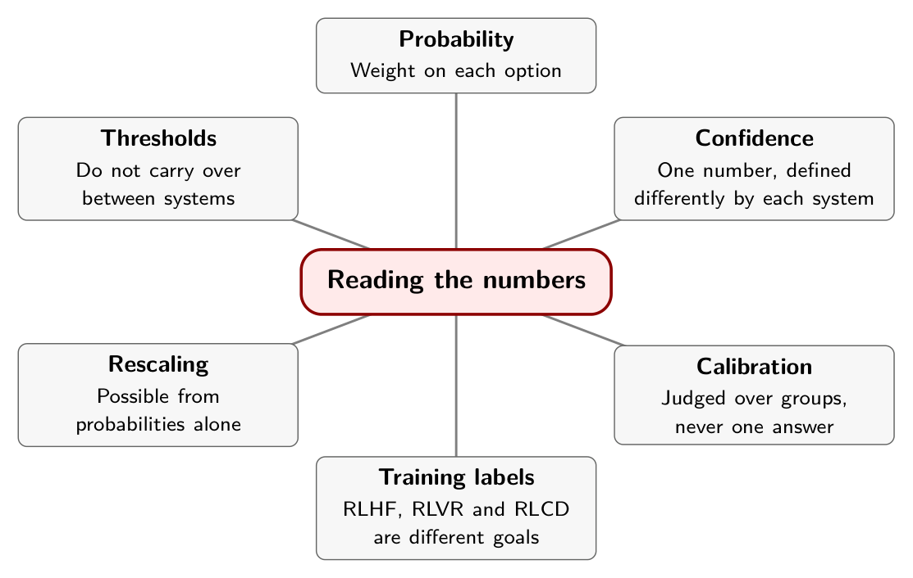

# Chapter 4. Reading the Numbers

Two dashboards sit side by side. Both report 80 correct out of 100 on a held-out set, for predictions whose top probability was about 0.8. On the first, the twenty misses each sent a ticket to the wrong queue, where a person moved it an hour later. On the second, the twenty misses each issued a refund nobody had approved.

The accuracy is identical and the dashboards are equally well calibrated. Nobody would automate both the same way. Calibration is the property that makes a probability usable, and it is silent on what you should do with it.

## Three numbers that get confused

A Choice or Score answer carries three things: the option probabilities, a selected answer, and a `confidence` field. They are different.

The probabilities are a distribution over your options and sum to one. The selected answer is the option with the most weight. The `confidence` field, the documentation says, is "a statistic computed from the probability distribution the answer already gives you": a single number from 0 to 1 for how concentrated the distribution is. Noul answers carry no confidence field, because the probability of yes already is the belief.[^ch4-1]

The practitioner report we return to in Chapter 6 hit the difference in its first call. A three-level anger question came back with 0.63 on its top level and a confidence of 0.44. The confidence is lower than the top probability because the other 0.37 sits on a single second level, so the distribution is split between two answers, not peaked on one.[^ch4-2]

The documentation does not spell the formula out, and says you are "never locked into our definition." Another project's README gives one for Jev, and it is a simple rescaling of the top probability: 0.63 on the top level of three is a confidence in the mid-0.4s, which fits the 0.44 that was reported.[^ch4-3] That is my reading of the README, not a statement of TypeSafe's implementation.

The practical point is that another model's `confidence` can be a different statistic. The Laya model computes it as one minus normalized entropy and warns that "a threshold carried over from Jev does not transfer."[^ch4-3b] A confidence threshold is a property of the model and its version, and you validate it there.

## Calibration is about groups

One vendor page states the idea plainly. Across many predictions from a well-calibrated model, outcomes assigned 0.2 should occur about 20 percent of the time and outcomes assigned 0.8 about 80 percent. "These rates describe groups of predictions, not a guarantee about any single answer."[^ch4-4]

Chapter 2 used a weather forecaster to make this concrete, and the practitioner report in Chapter 6 uses the same one. A model that says "90 percent sure" and is right half the time is overconfident, and its numbers cannot be relied on.[^ch4-2b] The test is never whether one 90 percent prediction was right. It is whether predictions that carried similar confidence were right at roughly that rate.

Finite groups are noisy. Of 100 predictions near 0.8, seeing 78 or 83 correct tells you little. Seeing 55 correct tells you a lot. A reliability table needs group sizes and intervals alongside its percentages, which is why the experiment in Chapter 6 reports both.

## Where the numbers come from

Chapter 2 named three ways a model can be taught. RLHF trains it toward answers people prefer, and InstructGPT is the standard research example.[^ch4-6] RLVR rewards outputs that can be checked automatically, such as a math result, and is associated with reasoning-model work like DeepSeek-R1, whose abstract reports strong performance "on verifiable tasks such as mathematics, coding competitions, and STEM fields."[^ch4-7] RLCD is TypeSafe's name for training toward decisions and probabilities that come true at the stated rate.[^ch4-5]

TypeSafe argues that RLHF can reward sycophancy and confident-sounding hallucinations, and that an output can be compelling to a person without being reliable enough for unattended automation.[^ch4-5b] That is a claim about a training objective. The recipe for RLCD has not been published, and I did not find anything independent that reproduces it.

Keep the three labels apart. One of the supplied notes describes RLCD as building on RLVR, but TypeSafe's own primer lists three separate paths, and that is the framing to use. A reward for a correct answer and a reward for honest uncertainty target different properties, and a model trained for either can still be badly calibrated on a population it never saw. Chapter 6 measures exactly that.

## Recalibrating after the fact

If reported probabilities do not match outcomes on your data, you can adjust them. One classic method, temperature scaling (Guo and colleagues, 2017), softens an overconfident model with a single setting and does not change which answer ranks first.[^ch4-8]

A hosted API returns probabilities, not the raw scores that method needs, and one practitioner concludes that it is therefore unavailable.[^ch4-2c] That is too strong. Softening the probabilities you are given, then renormalizing so they sum to one, has the same effect. The setting has to be fitted, so keep a labeled calibration set that is separate from anything you tuned prompts on. The ranking of options does not change, so the winner stays the same and only the sharpness moves.

The catch is precision. Jev rounds probabilities to two decimal places, so an answer of 1.00 or 0.00 carries almost no information to rescale.[^ch4-2d] Isotonic regression, which learns a correction curve from labeled examples, works from the returned probabilities alone and is the safer choice for API users.[^ch4-2e]

Neither method recovers evidence that was never in the state, and neither repairs a wrong ranking.

## In practice

- Decide which signal you will threshold on, the `confidence` field or the largest option probability, and measure both. The report in Chapter 6 found them nearly identical on one dataset; another evaluation it cites found the largest probability tracked accuracy better.
- Do not carry a threshold across models, model versions, or question types.
- Report calibration with group sizes and intervals. A percentage without an *n* is a rumor.
- Set the automation policy by what an error costs, not by the calibration curve alone.
- If you recalibrate, fit on a separate split and record the split.

## Remember this

A probability is not a promise about one answer. It is a claim about a group of answers.

{alt="Mindmap. Center: Reading the numbers. Branches: Probability (Weight on each option); Confidence (One number, defined differently by each system); Calibration (Judged over groups, never one answer); Training labels (RLHF, RLVR and RLCD are different goals); Rescaling (Possible from probabilities alone); Thresholds (Do not carry over between systems)."}

[^ch4-1]: TypeSafe AI, "Confidence," documentation, <https://docs.typesafe.ai/confidence.md>. It states that Noul answers "don't carry one" and that confidence "is derived from the probabilities."

[^ch4-2]: Nhu Hoang, "Jev vs. LLMs: When AI Moves from Generation to Decision-Making," Towards Data Science, September 25, 2026, <https://towardsdatascience.com/jev-vs-llms-when-ai-moves-from-generation-to-decision-making/>. Reported: the anger call (section 5, page 10); the forecaster analogy (section 6, page 11); isotonic regression working from returned probabilities and temperature scaling needing raw scores (page 12); rounding to two decimal places (page 15). Supplied copy.

[^ch4-3]: Laya project (GitHub: NandhaKishorM/laya), repository README, <https://github.com/NandhaKishorM/laya>. In its section on differences from Jev, the README says Laya's confidence "is 1 minus normalised entropy … not Jev's `(n*p_max - 1)/(n - 1)`. A threshold carried over from Jev does not transfer." (The README writes the middle dot and minus signs as typographic characters; I have used plain ASCII in the code span.) The TypeSafe confidence page cited above gives "(3 x largest probability - 1) / 2" as an approximation for three options.

[^ch4-4]: TypeSafe AI, "AI primer," documentation, <https://docs.typesafe.ai/introduction/machine-learning-primer.md>.

[^ch4-5]: TypeSafe AI, "AI primer," as cited above. The sycophancy and mode-dropping argument, and the statement that an output "can be compelling to a person without being reliable enough for unattended automation," are from this page.

[^ch4-6]: Long Ouyang et al., "Training language models to follow instructions with human feedback," 2022, <https://arxiv.org/abs/2203.02155>.

[^ch4-7]: DeepSeek-AI, "DeepSeek-R1: Incentivizing Reasoning Capability in LLMs via Reinforcement Learning," 2025, <https://arxiv.org/abs/2501.12948>. The TypeSafe primer cited above describes RLVR as having "created reasoning models that are strong at tasks such as mathematics, but slower and more expensive."

[^ch4-8]: Chuan Guo, Geoff Pleiss, Yu Sun and Kilian Q. Weinberger, "On Calibration of Modern Neural Networks," *Proceedings of the 34th International Conference on Machine Learning*, 2017, <https://proceedings.mlr.press/v70/guo17a.html>.

[^ch4-3b]: Laya README, as cited above.

[^ch4-2b]: Hoang, "Jev vs. LLMs," section 6 (supplied copy, page 11).

[^ch4-5b]: TypeSafe AI, "AI primer," as cited above.

[^ch4-2c]: Hoang, "Jev vs. LLMs," section 6 (page 12).

[^ch4-2d]: Hoang, "Jev vs. LLMs," section 6 (page 15).

[^ch4-2e]: Hoang, "Jev vs. LLMs," section 6 (page 12).
