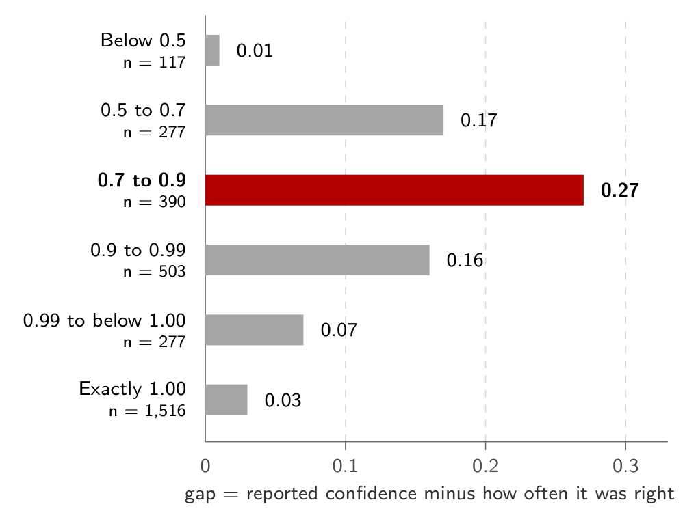
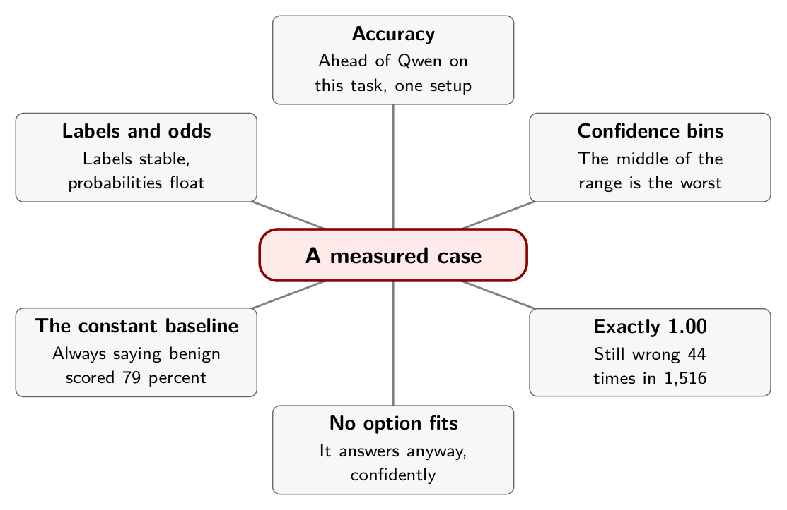

# Chapter 6. A Measured Case

Ten days after Jev's launch, Nhu Hoang published the result of deciding to stop reading other people's benchmarks and run one. The test used 3,080 bank-support messages, each labeled with one of 77 intents such as "card arrival," "wrong exchange rate" and "top-up failed," and asked Jev and an open model the same question of every message: which intent is this?[^ch6-1]

The article publishes its setup, its intervals and its failures. It is also one person's run on one dataset, and everything below is reported, not reproduced. I compared each figure with the article's page images, since the text copy I was given came through OCR. Where a number below is mine, it says so.

## The setup

The dataset is Banking77, a public collection of English bank-support messages, 3,080 of them in its test split with 40 per intent.[^ch6-2] Every message has a valid label, so the test has no "other" category. Jev, at version `jev-1.13.0`, answered one Choice question whose options were all 77 intents. The comparison model was Qwen3-Coder-Next-80B-A3B, served locally with vLLM, 4-bit weights, temperature zero and thinking disabled. Both models got the same categories and short descriptions. Jev was asked through a Choice question, and Qwen was prompted to return exactly one category name.

After a 100-example pilot to settle the prompts, each model ran once over the full set, alternating in blocks of 250.[^ch6-1b]

## Accuracy

On accuracy, Jev scored 81.1 percent and Qwen 76.4, a gap of 4.7 points whose 95 percent interval (3.7 to 5.7) stays above zero. The full table is in Appendix D.

Speed was close, with a median of 245 milliseconds for Jev and 249 for Qwen, and the author declines to read anything into it: Qwen ran locally with prefix caching, while Jev's timing included a network request from Japan to a remote server.

Qwen also produced 53 invalid labels, 1.72 percent of its answers, because nothing prevented it from returning a string outside the allowed set. Jev could not. My arithmetic agrees with the article's: 53 of 3,080 is 1.72 percent, and if every invalid Qwen answer were counted as correct, Qwen would reach about 78.1 percent and Jev would still lead by about three points.[^ch6-1c]

The author is explicit about the reach of this result: one Qwen model, one prompt, one inference configuration. It is evidence for this setup and not a claim that Jev beats every language model.

## Confidence, bin by bin

The more useful result is what happened to Jev's `confidence` field. The author sorted all 3,080 answers into six groups by that value and compared each group's average confidence with how often it was right.

{alt="Horizontal bar chart of the gap between reported confidence and observed accuracy in six confidence groups. The gaps are 0.01 below 0.5, 0.17 from 0.5 to 0.7, 0.27 from 0.7 to 0.9, 0.16 from 0.9 to 0.99, 0.07 from 0.99 to below 1.00, and 0.03 at exactly 1.00. The 0.7 to 0.9 group is highlighted as the largest."}

In every group the reported confidence sat above the observed accuracy, which is what overconfidence looks like. Weighted by group size, the gaps add up to 0.097, the article's expected calibration error. The counts and my arithmetic are in Appendix D.

The extremes held up. Below 0.5, Jev averaged 0.41 confidence and was right 39 percent of the time. At exactly 1.00 it was right 97.1 percent of the time across 1,516 messages, with 44 mistakes. The middle was worse. Between 0.7 and 0.9, average confidence was 0.81 and accuracy was 53 percent. Between 0.9 and 0.99, average confidence was 0.95 and accuracy was 79 percent.[^ch6-1d]

Two things follow. First, a threshold on this field means different things in different places. The behavior above 0.99 tells you nothing about the behavior between 0.7 and 0.9. Second, "exactly 1.00" is not the same as certainty. TypeSafe's primer says outcomes assigned probability 1.0 "should occur 100% of the time."[^ch6-3] Here the top group was right 97.1 percent of the time. One possible reason, which I have not tested, is that Jev rounds its probabilities to two decimal places, so a value displayed as 1.00 can stand for anything from about 0.995 up.[^ch6-1e]

The author also checked the two signals separately, the confidence field and the largest option probability, and found them almost identical on this data, with a small edge for the confidence field. An evaluation the article cites found the reverse, with the largest probability tracking accuracy better.[^ch6-1f] This is why Chapter 4 said to measure both.

## Numbers from other people's tests

The article collects several results from other evaluators. I have not seen their sources, so they are second-hand.

- One evaluation reported expected calibration errors of 0.082 for Choice, 0.079 for yes-or-no questions and 0.325 for Score. Calibration looked close on the first two and much weaker on Score.
- Another found all 40 predictions at confidence exactly 1.000 were correct. A third reported 100 percent accuracy at 0.99 and above, covering 60.2 percent of its traffic.
- One benchmark gave Jev 30 messages that belonged to no available category and offered no "none of these" option. Every one was filed under a listed category, with confidence of at least 0.99.
- In another, a "priority" rule that could not be determined from the text was applied anyway. Accuracy fell to 44.7 percent while average confidence stayed at 0.74.[^ch6-1g]

Read together, they say the same thing three ways. A high number is not knowledge. If the state doesn't contain what the question needs, or no option fits, the model still answers, and it can answer confidently. That is the case for the explicit "other" option in Chapter 3, and for testing the case where it is the right answer.

## A benchmark where accuracy misleads

Archestra tested Jev on a different kind of task: labeling 100 real tool calls from coding-agent sessions by their information-flow properties, as a classifier that sits on a security boundary. Their first observation was about the dataset. Seventy-nine percent of calls were harmless and stayed local, so a classifier that always answers "benign" scores 79 percent. A model at 75 percent is worse than a line of code.[^ch6-4]

The results are on the 337 of 400 decisions where three independent judge models agreed.

In this test the frontier model was more accurate than Jev, 98 percent against 93, and it missed more of the calls that mattered: it caught 4 of the 9 dangerous ones and Jev caught 7. Every one of Sonnet's eight errors on the strict set was a leak, a dangerous call allowed through. It treated an outbound search query as harmless reading, when the query itself can carry data out of a poisoned session.[^ch6-4b]

Four of the seven models tested scored below the constant 79 percent. That count is mine, read from Archestra's table.

Archestra also ran Jev five times. Across identical repeats, 394 to 398 of 400 labels matched, and nearly all flips were near-ties. But only 35 to 39 percent of the probabilities were bit-identical on the same payload, and they drifted by as much as 0.17. Reordering the option keys changed the outcome on five to seven calls per hundred for three-way labels, and about four in a hundred after subtracting baseline noise, costing 1.5 to 2 points of accuracy.[^ch6-4c] The report's conclusion is worth keeping: Jev's labels are mostly stable, its probabilities float, and if you plan to rely on a tight probability threshold, that matters.

## What this does and doesn't show

These are three experiments by three parties. None reproduces the others, and none tests your traffic. Hoang used one English dataset with no out-of-category messages, one local model on one GPU, and one remote model version.[^ch6-1h] Archestra used 100 calls, and its own review of the results found that some of the disagreement came from unclear instructions in its benchmark, not from the models.

What they do show is a pattern. The model was better than a comparison model on one task, worse than a frontier model on another, overconfident in the middle of its range on the first and useful as an escalation signal on the second. A summary that says "Jev is accurate" or "Jev is unreliable" is wrong in both directions. The accurate summary has to name the task, the population, the baseline and the error cost.

## In practice

- Always compute the constant baseline. If your traffic is 79 percent one class, that is the number to beat.
- Bin your own confidence values, report *n* per bin, and look at the middle of the range, not only the top.
- Include cases that belong to no category, and cases the state cannot answer, and check what the model does with them.
- Repeat your evaluation and permute your option order. Measure how much the decisions move, and set the width of your threshold accordingly.
- Report errors by cost. A 98 percent classifier that misses the dangerous cases can be worse than a 93 percent one that catches them.

## Remember this

Good on average and overconfident in the middle. A high number is not knowledge.

{alt="Mindmap. Center: A measured case. Branches: Accuracy (Ahead of Qwen on this task, one setup); Confidence bins (The middle of the range is the worst); Exactly 1.00 (Still wrong 44 times in 1,516); No option fits (It answers anyway, confidently); The constant baseline (Always saying benign scored 79 percent); Labels and odds (Labels stable, probabilities float)."}

[^ch6-1]: Nhu Hoang, "Jev vs. LLMs: When AI Moves from Generation to Decision-Making," Towards Data Science, September 25, 2026, <https://towardsdatascience.com/jev-vs-llms-when-ai-moves-from-generation-to-decision-making/>. Supplied copy. Setup: section 8.1 (pages 18 to 19). Accuracy, timing, invalid labels: section 8.2 (pages 19 to 20). Confidence groups: section 6, Figure 11 (page 14), and section 8.3 (pages 20 to 22). Figures from other evaluators (scienthoon, themsquared, PriorBench): sections 6 and 7.3 (pages 14 and 17 to 18). Rounding to two decimal places: page 15. Compared against page images for the figures shown.

[^ch6-2]: Casanueva, Temčinas, Gerz, Henderson and Vulić, "Efficient Intent Detection with Dual Sentence Encoders," 2020, arXiv:2003.04807, <https://arxiv.org/abs/2003.04807>, as cited in the reference list of Hoang's article, which gives the split sizes (10,003 training and 3,080 test messages, 40 test messages per intent) and the CC BY 4.0 license.

[^ch6-3]: TypeSafe AI, "AI primer," documentation, <https://docs.typesafe.ai/introduction/machine-learning-primer.md>. It states that outcomes assigned a probability of 1.0 "should occur 100% of the time" and that these rates "describe groups of predictions, not a guarantee about any single answer."

[^ch6-4]: Arseny Kravchenko, "We Tested Jev on 100 Real Agent Calls. How Easy Is It To Beat a Constant?," Archestra, September 21, 2026, <https://archestra.ai/blog/we-tested-jev-on-100-real-agent-calls>. The 79 percent baseline, the results table, the 337 of 400 agreement set, the eight leaks by Sonnet 5, and the five-run stability test are all from this article.

[^ch6-1b]: Hoang, "Jev vs. LLMs," section 8.1 (pages 18 to 19).

[^ch6-1c]: Hoang, "Jev vs. LLMs," section 8.2 (page 20).

[^ch6-1d]: Hoang, "Jev vs. LLMs," section 8.3 (page 21).

[^ch6-1e]: Hoang, "Jev vs. LLMs," section 6 (page 15).

[^ch6-1f]: Hoang, "Jev vs. LLMs," sections 6 and 8.3 (pages 15 and 22).

[^ch6-1g]: Hoang, "Jev vs. LLMs," section 7.3 (pages 17 to 18).

[^ch6-4b]: Kravchenko, "We Tested Jev on 100 Real Agent Calls," Archestra, section "Live Examples: What Models Actually Did."

[^ch6-4c]: Kravchenko, "We Tested Jev on 100 Real Agent Calls," Archestra, section "How stable is Jev itself? Reproducibility & Option Order."

[^ch6-1h]: Hoang, "Jev vs. LLMs," section 9.2 (page 23).
