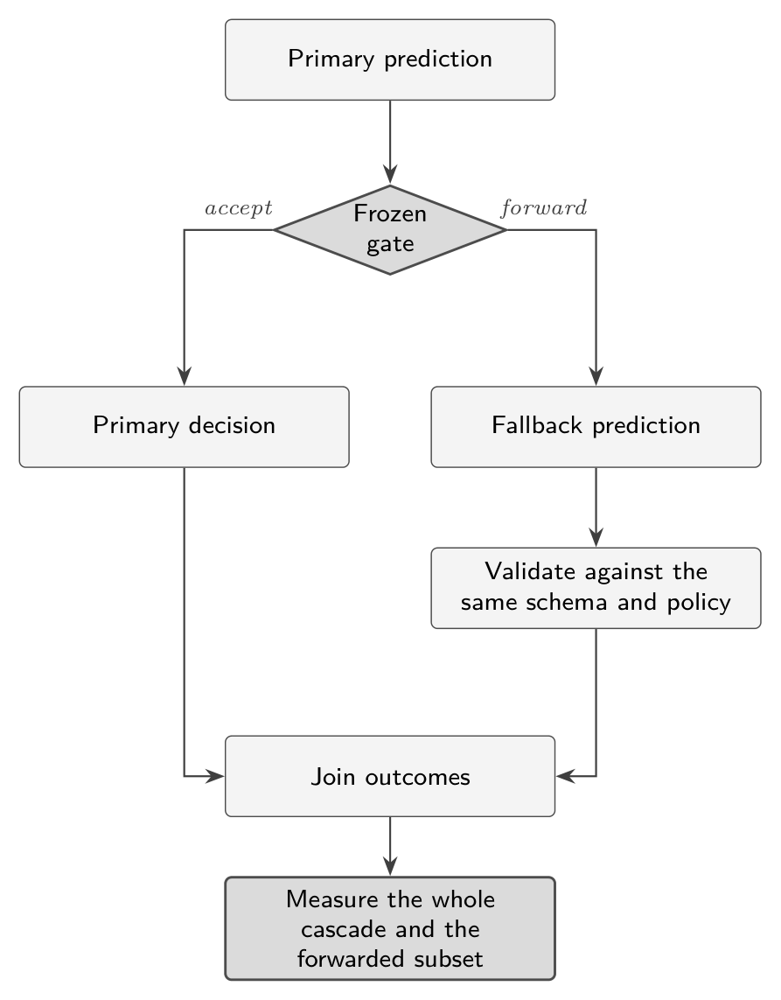

# Chapter 6. The Cascade That Made Things Worse

The plan appears in several of the launch-week introductions to decision models, and it is a good plan. Let the small, fast model handle the cases it is sure of. Send the rest to something larger. You pay frontier prices only for the hard minority, and the confidence threshold is a dial in your own code.

Nhu Hoang built that system on the 3,080-message Banking77 test from Chapter 5 and measured it. Keeping Jev's answers at confidence exactly 1.00 and sending the rest to Qwen fixed 84 mistakes. It introduced 211 new ones.[^ch6-1]

## The case for the cascade

The launch-week guide that spread the pattern makes the arithmetic vivid. Take a million support tickets. Send all of them to a frontier model at about three cents a case and the bill is $30,400. Put Jev in front at $0.0004 a case, escalate the 20 percent that need it, and the bill is $6,480, a saving of 79 percent, with 800,000 tickets answered in under half a second.[^ch6-2]

The arithmetic checks. A million cases at $0.0304 is $30,400. A million at $0.0004 plus 200,000 at $0.0304 is $400 plus $6,080, or $6,480, and the saving is 78.7 percent. Those are my sums from the guide's per-case figures, which it attributes to TypeSafe's own benchmark.

Two things in the guide's own framing deserve a second look. It calls the 62/18/20 traffic split "illustrative", and says yours "depends on your traffic and where you set your thresholds." And the $6,480 covers the Jev calls and the 200,000 escalations. It does not price the 180,000 tickets the diagram sends to a cheaper specialist model, or the deterministic code that handles the other 620,000. That omission is my reading of the figure, not something the guide states. It doesn't change the direction of the saving, but the figure is a sketch, not an invoice.

Everything here rests on one assumption: that when Jev is unsure, the fallback is better. That is a testable claim.

## The test

Hoang sorted Jev's answers by the `confidence` field and, at each threshold, kept Jev's answer when the confidence was at or above the threshold and sent everything else to Qwen. Then the cascade's accuracy was compared with Jev alone at 81.1 percent.

| Threshold on Jev's confidence | Share handled by Jev | Cascade accuracy | Random routing at the same share |
|---|---|---|---|
| Jev only | 100% | 81.1% | |
| at least 0.5 | 96.2% | 80.7% | 80.9% |
| at least 0.7 | 87.2% | 80.5% | 80.5% |
| at least 0.9 | 74.5% | 79.7% | 79.9% |
| at least 0.99 | 58.2% | 77.6% | 79.1% |
| exactly 1.00 | 49.2% | 76.9% | 78.7% |
| Qwen only | 0% | 76.4% | |

*Reported by Hoang; column headings checked against the page images.*

Every cascade was worse than Jev alone. At each step down the table, handing more of the work to the fallback lowered accuracy. The last column is a comparison the article includes: send a random subset to Qwen, sized to match the share Jev kept. At every threshold, random routing did at least as well as routing by confidence, and strictly better at four of the five. That comparison is in the article's table; the reading of it is mine.

## Why

Jev's confidence did its job. At the 1.00 threshold it kept 1,516 messages and was right on about 97 percent of them. The 1,564 it forwarded were the hard ones. Qwen was right on only 57 percent of them.[^ch6-1b]

Now do the bookkeeping. Jev's overall accuracy is 81.1 percent, so it was right on about 2,498 of 3,080. It was right on 1,472 of the kept messages. That leaves roughly 1,026 correct answers among the 1,564 it forwarded, about 66 percent. On the very messages the gate sent onward, then, Jev alone was right about 66 percent of the time, and the fallback was right about 57 percent. Qwen fixed 84 of Jev's mistakes and broke 211 of Jev's correct answers, a net loss of 127 answers, or 4.12 points across the 3,080. These are my derivations from the reported figures. They agree with each other to within a rounding error of one answer, which is reassuring, but they inherit the article's rounding of the 57 percent.

The lesson is the one the article states: knowing which cases a model finds difficult is not the same as knowing another model can solve them.[^ch6-1c] Low confidence measured how hard the cases were for Jev. Those cases were also hard for Qwen, and the fallback had not been shown to be better on them.

That is why the quality question has to be conditional. Let *S* be the subset the gate forwards. The claim you need is not that the fallback is a better model overall. It is that

$$
\operatorname{Accuracy}(\text{fallback} \mid S) > \operatorname{Accuracy}(\text{primary} \mid S).
$$

A fallback's benchmark score does not answer that. Its errors can overlap the primary model's difficult cases, and the gate has changed the population it sees.

{alt="Flow diagram. A primary prediction meets a frozen gate. Accepted cases become the primary decision. Forwarded cases go to a fallback prediction. The fallback output is validated against the same schema and policy. Both branches join into outcomes, which are measured for the whole cascade and for the forwarded subset."}

## Cost and latency are part of the test

A cascade adds a second call for every forwarded case. A simple model of the expected cost per case is

$$
C = C_{\text{primary}} + q\,C_{\text{fallback}} + C_{\text{retrieval}} + C_{\text{policy}} + C_{\text{handoff}},
$$

where *q* is the forwarded fraction. Add human review, retries and infrastructure where they apply. A lower per-call price does not by itself make a completed workflow cheaper. Latency needs its own measurement too, because a serial forwarded request pays for both model calls.

## Where fallbacks have worked, as reported

The evidence is not all one way. Archestra reported that Jev's confidence gave them a useful escalation signal on their security task, with no errors among predictions at 0.7 or above.[^ch6-3] LangChain describes Browserbase rebuilding its Stagehand browser action step so that Jev picks the action and target, with anything below a 0.7 confidence threshold falling back to an LLM. In early testing, median latency for that step dropped from 1.97 seconds to 0.46, about 4.3 times faster.[^ch6-4] Neither of these reports what happens to accuracy on the forwarded cases. What they show is that a gate can be worth having. They don't show that any fallback is worth trusting.

Hoang's own advice is to add a fallback only if testing shows it improves the uncertain cases, and to consider fallbacks that are not models: fetch the missing data, validate the input, or ask the user a clarifying question.[^ch6-1d]

## In practice

- Before you build a cascade, measure the fallback on the forwarded subset, using the same labels and the same schema as the primary.
- Count both directions: errors fixed and errors introduced. The net is what matters.
- Compare against random routing at the same share. If a random handoff does as well as your gate, the gate is not selecting for the fallback's strength.
- Choose the threshold on a separate calibration split, freeze it, then test once.
- Consider fallbacks that aren't models: a lookup, a validation step, a question to the user, a person.
- Price the whole path, including retries and review, and measure end-to-end latency.

[^ch6-1]: Nhu Hoang, "Jev vs. LLMs: When AI Moves from Generation to Decision-Making," Towards Data Science, September 25, 2026, <https://towardsdatascience.com/jev-vs-llms-when-ai-moves-from-generation-to-decision-making/>, sections 8.3 and 8.4 (supplied copy, pages 20 to 23). The table, the 97 percent and 57 percent figures, the 84 and 211 counts, and the closing lesson are from these pages. The article's own summary advises adding a fallback only if it improves the uncertain cases.

[^ch6-2]: unicodeveloper, "The Ultimate Guide to Jev: The new Frontier AI for faster decisions," Medium, September 17, 2026 (supplied copy, page 11; the original web address was not preserved). The figure on that page prices Jev at $0.0004 a case and GPT-5.6 Terra at $0.0304, labels both as from TypeSafe's published workflow benchmark, and labels the 62/18/20 split "illustrative." I checked the figures against the page image.

[^ch6-3]: Arseny Kravchenko, "We Tested Jev on 100 Real Agent Calls. How Easy Is It To Beat a Constant?," Archestra, September 21, 2026, <https://archestra.ai/blog/we-tested-jev-on-100-real-agent-calls>.

[^ch6-4]: Sydney Runkle and Hunter Lovell, "Building Prod with Jev and LangGraph," LangChain, September 25, 2026, <https://www.langchain.com/blog/building-prod-with-jev-and-langgraph>. The Stagehand figures are described there as early testing.

[^ch6-1b]: Hoang, "Jev vs. LLMs," section 8.4 (page 22).

[^ch6-1c]: Hoang, "Jev vs. LLMs," section 8.4 (page 22).

[^ch6-1d]: Hoang, "Jev vs. LLMs," section 9.1 (pages 22 to 23).
