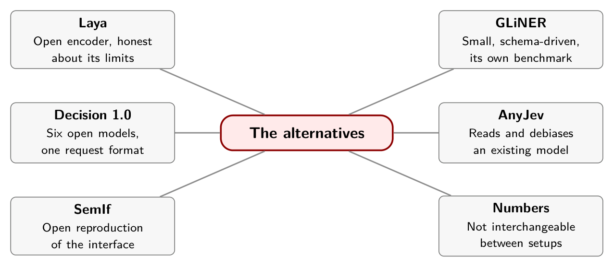

# Chapter 8. The Alternatives

Christian Graham wanted to know what a small, free, local decision model does when being wrong has consequences, so Graham taught one to play Doom. The model was Laya, a 421-million-parameter model that looks at the current situation and picks an answer in one pass. It is told about health, ammo, enemies and walls, picks an action with a confidence, and a safety check catches obvious mistakes before the action happens.

At first it never shot at anything. Not once, in any test. The fix was to stop making "shoot" compete with every other move in one long list and ask a single yes-or-no question instead: should I shoot? Even then it needed checks on top, because left alone it would fire with no ammo, or at an enemy that wasn't lined up. Later came small override rules for spinning in corners and oscillating between two useless moves, each logged so nothing was hidden. The model survived and explored properly. As of the article, it had not found the exit.[^ch8-1]

That is a small story with a large moral. The interface, state in and probabilities out, is shared across a growing family of systems. The behavior is not.

## Choose by what you need to control

Six candidates come up repeatedly. They differ in what you can inspect, host, fine-tune and calibrate, and those differences matter more than any benchmark line.

| Candidate | What it is | What to test first |
|---|---|---|
| Jev (TypeSafe) | Hosted, closed weights, typed-decision API | Whether its uncertainty separates automation from review on your cases |
| Laya | Open encoder checkpoints, a Jev-compatible request shape | Which checkpoint, and whether your options fit its option budget |
| Decision 1.0 | Six open-weight models, 0.6B to 9B, encoder and adapted-decoder branches | Which release and runtime fit your evidence length and latency |
| GLiNER2.5-Decide | 340M open English encoder, labels supplied at call time | Whether your task is classification, and whether its benchmark resembles yours |
| AnyJev | A toolkit that reads and debiases an existing LLM's option probabilities | What each level needs, and what it doesn't fix |
| SemIf | An independent open-model reproduction of the interface | How option wording and order change the result |

A familiar request shape does not make the outputs or the thresholds interchangeable. Chapter 4 already showed that with confidence.

## Encoders: Laya and GLiNER2.5-Decide

Laya's README is unusually direct about where it stops. Its base checkpoints score near chance on the project's typed-decisions benchmark zero-shot, 0.362 and 0.352 against a random baseline of 0.318 and a majority-class baseline of 0.461. The 0.766 figure comes from the checkpoint fine-tuned on that benchmark's own training split, so the README calls Laya "a fast base to specialise, not a zero-shot decision engine."[^ch8-2]

Its options share a fixed token budget, so a 77-option question gets only three or four tokens per label at default settings, which makes similar labels indistinguishable. On Banking77 the README reports 0.425 for Laya at that default against 0.870 for Jev on 72 labels. It also documents a narrow negation failure: in five cancellation examples, one checkpoint selected "cancel account" for all four negated requests and another for two, with one answer at probability 0.9998. It adds that these are narrow examples, not evidence that every negated input fails.[^ch8-2b] Archestra's security benchmark found something related: Laya caught all nine dangerous calls only because it flagged every call, for 100 percent recall and about 12 percent precision.[^ch8-3]

GLiNER2.5-Decide is a 340M-parameter English classification model from Fastino. Labels are passed at call time, with no prompt template and no generated tokens. Its release post reports the highest average, 60.1 percent, on a 17-dataset benchmark of 5,100 examples that the company generated internally, ahead of SemIf, Laya and an open reproduction called JevK5, and it scores a decision as correct only when the whole label set matches exactly.[^ch8-4] The same post says something that is easy to lose in retelling: "This is an internal benchmark, not JevBench, and JevK5 is an open reproduction rather than TypeSafe's Jev." A leaderboard that beats JevK5 has not beaten Jev.

The model card describes a specialist that "does not reason, explain, or answer open questions." The release adds that the family can return character-level spans for extraction tasks, and states that classification answers themselves do not return evidence spans.[^ch8-4b] Asking for an extraction is different from receiving a causal explanation of a classification.

## A family: Decision 1.0

The vLLM Semantic Router team released Decision 1.0 on September 22 as six open-weight models. Kai and Lex, at 0.6B, are encoders. Eos, Sol, Nox and Lux, from 0.8B to 9B, adapt Qwen3.5 backbones. Input budgets differ sharply: 1,024 tokens for the encoders and 16,384 for the larger models, covering state, question and candidate descriptions together. The request format is the System One format, so the official TypeSafe SDK can call a deployment you host.[^ch8-5]

On the release's selected 54-task suite of 3,766 scored decisions, Lux, the largest, scores 76.94. The post is candid that "the hosted Jev reference remains higher overall at 81.05."[^ch8-5b] That suite is not GLiNER's, and neither is Hoang's; the three cannot be merged into one ranking.

One statement to take literally: native integration into vLLM Semantic Router and an Open Decision API are described as "planned next." A roadmap is not an installation claim.

## Readout toolkits: AnyJev and SemIf

A different approach starts from an ordinary open LLM and reads the probabilities it would put on each option's first token. AnyJev's documentation states plainly what that gets you: "a ranking. What you do not get: a probability." Two biases are baked in. The model prefers some labels regardless of input, and it prefers some positions in the list, so reordering options can change the winner.[^ch8-6]

AnyJev's levels are a ladder of remedies, each with a stated limit. Level L0 applies training-free corrections: a prior correction and cyclic-shift marginalization, which shows a K-option question in K rotations at the cost of K prompts. It does not make the model's uncertainty calibrated, and a model overconfident on everything remains so. L1 fits temperature scaling on 100 to 500 labeled examples of the same question, and cannot survive distribution shift beyond that set or repair a wrong ranking. L2 fits a closed-form head on the model's hidden state, needs at least max(8, 2K) labels and in practice 100 to 300, and needs a backend that exposes hidden states.[^ch8-6b] Only L0 is training-free. L1 and L2 need labeled examples of your own question.

SemIf is an independent open-model project that "reproduces that interface pattern with open models; it does not reproduce Jev's undisclosed model or training." Its README notes that returned probabilities are conditional on the supplied options, and that it recently added per-workload temperature calibration, which leaves the selected option unchanged.[^ch8-7] Archestra's option-rotation test shows why the position caveat matters: small constrained decoders such as a 0.6B Qwen always chose option A and a 2B MiniCPM always chose the last option. Nine examples in the prompt lifted their accuracy by 20 to 34 points, and a 4B SemIf then kept the right answer in 92 of 100 reordered tests.[^ch8-3b]

## Numbers that aren't interchangeable

The same dataset name can appear with different results, so the figures here need care. Hoang reported 81.1 percent for Jev on the 3,080-message Banking77 test with 77 labels (Chapter 6). The Laya README reports 0.870 for Jev on Banking77 with 72 labels. Both are honest numbers from different setups, and neither can be substituted for the other.

Sources also move. GLiNER's release post gives 60.1 percent for its model and 57.5 for JevK5; the model card, checked the same day, lists 60.2 and 57.6.[^ch8-4c] A repository's main branch can change under a citation: SemIf added calibration on September 22, and a description written earlier is already out of date.

For a fair application comparison, fix the cases and the labeling policy first. Let each system use the interface it supports, and record differences in prompts, candidate descriptions, truncation, quantization, hardware and retries. Run a rules or majority-class baseline alongside all of them. Nothing in these sources establishes a universal winner.

## In practice

- Pick candidates by what you must control: hosting, weights, fine-tuning, calibration. Then test each on your own cases.
- Check option budgets and input limits against your real label count and evidence length before you compare accuracy.
- Add negation, contradictory-evidence and out-of-category cases to every comparison.
- Pin model and repository revisions. Treat a main branch as a moving target.
- Never carry a threshold from one system to another. Calibrate each on your own data.
- Read the "limits" section of a project's documentation first. The good ones have one.

## Remember this

The request shape is shared. The behavior, limits and numbers are not.

::: {.center}

{alt="Mindmap. Center: The alternatives. Branches: Laya (Open encoder, honest about its limits); GLiNER (Small, schema-driven, its own benchmark); Decision 1.0 (Six open models, one request format); AnyJev (Reads and debiases an existing model); SemIf (Open reproduction of the interface); Numbers (Not interchangeable between setups)."}

:::

[^ch8-1]: Christian Graham, "Laya: a free, local alternative to Jev — and it can even play Doom(ish)," Medium, September 19, 2026 (supplied copy; the original web address was not preserved). The article says Claude "wrote basically all the code," and that finding the way out is the part that "still doesn't work."

[^ch8-2]: Laya project (GitHub: NandhaKishorM/laya), repository README, <https://github.com/NandhaKishorM/laya>. The near-chance base scores, the option-budget explanation, the Banking77 comparison (Jev on 72 labels, Laya on 77 at default settings), and the negation examples are from its "Where Jev leads" and "Honest limits" sections. The README also reports Laya's own results against Jev on other tasks; those are the project's figures, not independent ones.

[^ch8-3]: Arseny Kravchenko, "We Tested Jev on 100 Real Agent Calls. How Easy Is It To Beat a Constant?," Archestra, September 21, 2026, <https://archestra.ai/blog/we-tested-jev-on-100-real-agent-calls>.

[^ch8-4]: Fastino, "GLiNER-2.5-Decide" release post, <https://fastino.ai/blog/gliner-2-5-decide-open-weight-decision-model>; model card, <https://huggingface.co/fastino/GLiNER2.5-Decide>. The post gives 60.1 percent, 57.5 for JevK5, 56.4 for SemIf and 46.6 for Laya on "Fast Decisions," an internal suite of 5,100 examples across 17 datasets. The card lists 60.2 and 57.6.

[^ch8-5]: vLLM Semantic Router Team, "Introducing Decision 1.0: Open Decision Foundation Models," September 22, 2026, <https://vllm-sr.ai/blog/decision-models/>. The model list, input budgets, the 76.94 and 81.05 scores, and the roadmap statement are from this post.

[^ch8-6]: Nokia Applied Research, AnyJev, "What each level does, and does not do," <https://raw.githubusercontent.com/nokia-applied-research/AnyJev/main/docs/levels.md>; project page <https://github.com/nokia-applied-research/AnyJev>.

[^ch8-7]: SemIf project (GitHub: TheoLeeCJ/SemIf; formerly OpenJev), repository README, <https://github.com/TheoLeeCJ/SemIf>. The README describes SemIf as an independent project not affiliated with Jev or TypeSafe, and lists per-workload temperature calibration among its changes dated September 22, 2026.

[^ch8-2b]: Laya README, section "Honest limits."

[^ch8-4b]: Fastino, GLiNER-2.5-Decide release post, as cited above.

[^ch8-5b]: vLLM Semantic Router Team, Decision 1.0 post, section "Measured across 54 tasks."

[^ch8-6b]: AnyJev, levels documentation, section "L2: a closed-form head on the hidden state."

[^ch8-3b]: Kravchenko, "We Tested Jev on 100 Real Agent Calls," Archestra, section "The Anatomy of Failure: Position Priors & Calibration."

[^ch8-4c]: Fastino release post and model card, as cited above.
