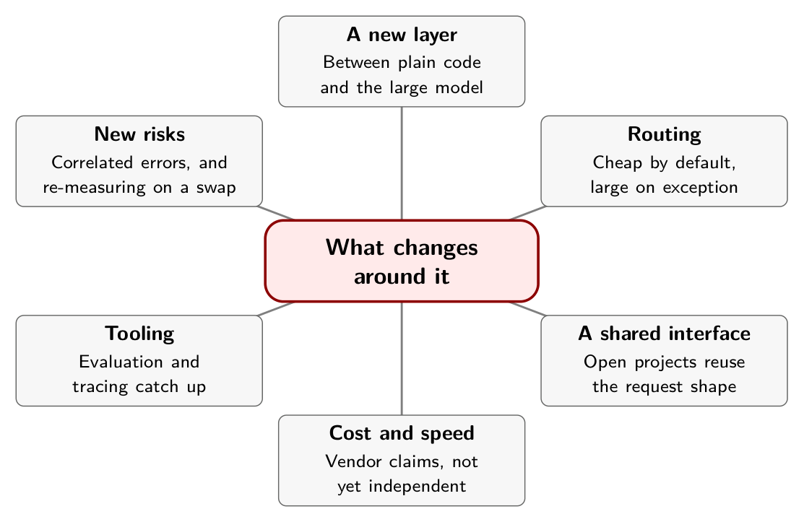

# Chapter 9. What Changes Around It

On September 22, 2026, seven days after Jev launched, an open project released six models that take the same request: a state, a model name and a set of named questions. The vLLM Semantic Router team's Decision 1.0 says it "uses the upstream System One request format," and that you can call a deployment of its models with TypeSafe's own Python SDK.[^ch9-1]

A week is not long to copy an interface. It suggests that the interface, more than any single model, is the part that spreads. This chapter keeps two things apart: what has been reported about the ecosystem, and what I think follows from it.

## What has been reported

**A layer between code and the large model.** LangChain's launch-week article describes the pattern. For three years, it says, most agents routed everything through one frontier model. Jaya Gupta calls what comes next "the Great Unbundling of Intelligence": capabilities get pulled apart, and each goes to the cheapest model that can handle it. Jev, in this telling, "pulls out judgment." LangChain adds that Jev does not fully replace a large model for most uses. It handles the bounded choices it is confident about and hands the rest on, which is the shift Gupta describes from "frontier by default and optimize later" to "cheap by default, frontier on exception."[^ch9-2]

The same article gives two speed figures. In its own test, with Jev handling the classification step in a graph and Sonnet as the judge, Jev was 5 to 6 times faster on that step. And Browserbase's Stagehand step, covered in Chapter 7, fell from 1.97 to 0.46 seconds in early testing. Both are reported by LangChain, and neither says what happened to accuracy on the hard cases.[^ch9-2b]

**A shared interface.** Decision 1.0 is not alone. SemIf, an independent open project, says it "reproduces that interface pattern with open models." Laya's README has a section titled "Self-Hosting: HTTP Server (Jev-compatible)" and another on what differs "when you port a client."[^ch9-3] The request shape is being treated as a standard while the behavior behind it differs, which is the subject of Chapter 8.

**Tooling catching up.** LangChain says its LangSmith product "has dedicated views for decision models like Jev, showing the inputs and calibrated outputs for each decision."[^ch9-2c] That is a vendor describing its own product, but it shows where the tooling is heading: a decision is something you inspect, not only a string you log.

**Cost and speed, as claimed.** TypeSafe's own comparison puts Jev at $0.042 per million input tokens with output free, against "from $0.20 to $10" per million input tokens for existing large models, whose output tokens it says cost about five times as much.[^ch9-4] One self-reported launch-week example: a developer classified 1,018 research papers for $0.08 in total, at a median 256 milliseconds per paper.[^ch9-5] These are vendor and self-reported figures. Nothing in the sources I captured reproduces them independently.

## My reading

What follows is my inference from those reports. I have no source that says it.

1. **The interface may outlast any one model.** If the request shape is shared, a team can write its questions once and swap the engine, hosted or open. That makes trying another engine cheaper. It does not make switching free, because Chapter 4 showed that thresholds do not carry between systems. You can change the engine quickly, but you have to re-measure it.
2. **The lasting asset is your labeled cases.** The questions, the answer lists and the cases you have judged are the parts you keep when the engine changes. Chapters 6 and 13 are about building them.
3. **The developer's job moves.** Less of it is wording a prompt. More is defining the answer space, building the evaluation set and writing the policy that decides what may run, which is Chapters 10 and 13.
4. **Large models keep their job.** They still write, and they still handle open-ended reasoning. The decision layer chooses what reaches them, and Chapter 7 shows that this hand-off has to be measured, not assumed to help.
5. **Concentration is a risk.** If many products route through one hosted decision model, its mistakes line up across all of them, and none of them can see its objective. The notes behind Chapter 11 call this "decision monoculture," as a hypothesis, not a finding.[^ch9-6] Open weights you run yourself reduce the dependence. They bring a different burden, since you must validate them, and Laya's own README says its base checkpoints score near chance zero-shot.[^ch9-7]
6. **What would change my mind.** An independent reproduction of the latency and cost claims. Published evidence that a cascade gains accuracy on the cases it forwards. A published training recipe.

## In practice

- Write your questions in a form you could point at another engine. Keep the schema, the labeled cases and the thresholds together in your repository.
- Budget a re-measurement whenever you swap the engine or its version.
- Treat every cost and speed number in this chapter as vendor-reported or self-reported until you have measured your own.

## Remember this

A cheap decision layer changes how work is routed, and the shared interface may outlast any one model.

{alt="Mindmap. Center: What changes around it. Branches: A new layer (Between plain code and the large model); Routing (Cheap by default, large on exception); A shared interface (Open projects reuse the request shape); Cost and speed (Vendor claims, not yet independent); Tooling (Evaluation and tracing catch up); New risks (Correlated errors, and re-measuring on a swap)."}

[^ch9-1]: vLLM Semantic Router Team, "Introducing Decision 1.0: Open Decision Foundation Models," September 22, 2026, <https://vllm-sr.ai/blog/decision-models/>: "Decision uses the upstream System One request format: state, model, and named questions," with the "official TypeSafe Python SDK or an equivalent HTTP request" against "your own SystemOne-compatible deployment." Jev launched on September 15, 2026 (Diogo Almeida, "Introducing System One Models & Jev," TypeSafe AI, <https://typesafe.ai/blog/introducing-system-one-models-and-jev>). The seven days between them is my arithmetic from the two dates.

[^ch9-2]: Sydney Runkle and Hunter Lovell, "Building Prod with Jev and LangGraph," LangChain, September 25, 2026, <https://www.langchain.com/blog/building-prod-with-jev-and-langgraph>. The article says: "Jaya Gupta calls what comes next 'the Great Unbundling of Intelligence': those capabilities get pulled apart, and each goes to the cheapest model that can handle it. Jev pulls out judgment, returning structured decisions instead of generated text." It also says "Jev doesn't fully replace an LLM for most use cases. It handles the bounded choices it's confident about and hands everything else to an LLM. That's the shift Gupta describes from 'frontier by default and optimize later' to 'cheap by default, frontier on exception.'"

[^ch9-2b]: Runkle and Lovell, "Building Prod with Jev and LangGraph." The article reports Jev "5–6x faster on the classification step across trials" against Sonnet as the judge, and the Stagehand latency drop in early testing.

[^ch9-2c]: Runkle and Lovell, "Building Prod with Jev and LangGraph," section on tracing.

[^ch9-3]: SemIf project (GitHub: TheoLeeCJ/SemIf), README, <https://github.com/TheoLeeCJ/SemIf>: "Jev is TypeSafe's closed service for runtime-defined semantic decisions. This project reproduces that interface pattern with open models; it does not reproduce Jev's undisclosed model or training." (The words "interface pattern" are in bold in the original.) Laya project (GitHub: NandhaKishorM/laya), README, <https://github.com/NandhaKishorM/laya>: the section "Self-Hosting: HTTP Server (Jev-compatible)" and "Three things differ from Jev when you port a client."

[^ch9-4]: Almeida, "Introducing System One Models & Jev." The comparison table gives Jev's input tokens at "$0.042 / MTok" with output "FREE (too cheap to meter)," and existing large models' input tokens "from $0.20 to $10 / MTok" with output tokens "~5x more expensive than input tokens." This is TypeSafe's own comparison.

[^ch9-5]: unicodeveloper, "The Ultimate Guide to Jev: The new Frontier AI for faster decisions," Medium, September 17, 2026 (supplied copy, pages 12 and 13; the original web address was not preserved). The guide quotes a developer's post reporting "$0.08 total cost and 256ms median end-to-end latency per paper" for 1,018 papers, and tells readers to treat its launch-week examples as artifacts "rather than production case studies."

[^ch9-6]: Supplied notes, `jev.txt`, list "Decision monoculture" among ten failure modes to anticipate: "Thousands of companies use the same model, causing correlated errors." It is a proposal, not evidence.

[^ch9-7]: Laya README, section "Honest limits": "The base checkpoints are near chance on typed-decisions zero-shot."
