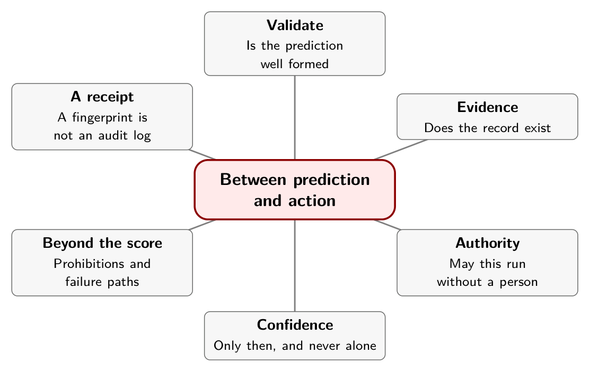

# Chapter 10. Between Prediction and Action

Suppose the model returns a probability of 1.0 that the customer is requesting a refund. The customer is, in fact, requesting one. The account has not been verified, the charge has not been confirmed in the payment records, and the person who would normally approve refunds over a certain size is on leave.

Does the software issue the refund?

If the answer depends on the probability, the system has no policy. It has a model with a hand on the till. The correct answer is that the probability is irrelevant to that question. It is evidence about what the customer wants, and it says nothing about whether anyone may act on it.

## A small lab

The project's `examples/` folder contains an offline lab that makes this concrete. It uses six explicitly synthetic probability distributions over three labels (billing, technical, other), so it needs no API key and measures no real model. What it does have is a policy function, a set of metrics, and a receipt.

Here is the policy, condensed.

```python
def policy(prediction, *, evidence_present, action="route", threshold=0.8):
    try:
        prediction.validate()          # labels, finite, sums to one
    except ValueError:
        return {"status": "review", "reason": "invalid_prediction"}
    if not evidence_present:
        return {"status": "review", "reason": "missing_evidence"}
    if action != "route":
        return {"status": "review", "reason": "action_outside_auto_policy"}
    label = prediction.winner()
    top_two = sorted(prediction.probabilities.values(), reverse=True)[:2]
    if top_two[0] == top_two[1]:
        return {"status": "review", "reason": "tie"}
    if label == "other" or top_two[0] < threshold:
        return {"status": "review", "reason": "uncertain_or_other"}
    return {"status": "route", "destination": label,
            "reason": "within_demo_policy"}
```

The order is intentional. First, check that the prediction is well formed: known labels, finite probabilities, a distribution that sums to one. A malformed response never reaches a threshold. Second, check that the evidence the decision needs exists. Third, check whether the requested action is in the class the policy allows to run automatically at all; here only routing is. Fourth, deal with ties, the "other" answer, and low confidence. Only then does the function propose a route.

Ask it for a refund action, with a probability of 1.0, and it returns a review outcome with the reason `action_outside_auto_policy`. A test in the lab enforces this, and five more cover missing evidence, malformed distributions, ties, hand-calculated metrics and zero coverage. All six pass; I ran them for this chapter.

The function returns a proposal and executes nothing. Its 0.8 threshold is a teaching parameter, not a recommended cutoff.

## What a threshold does, on six cases

The lab's six examples are constructed. Five of the six top labels are correct. When I ran it, the metrics came out as follows.

| Metric | Value |
|---|---|
| Accuracy | 0.833 (five of six) |
| Majority-class baseline | 0.500 |
| Multiclass Brier score | 0.381 |
| Negative log likelihood | 0.657 |
| Top-label expected calibration error | 0.225 |
| Policy coverage | 0.500 (three of six routed) |
| Selective accuracy | 0.667 (two of the three routed were right) |

The Brier score here is the mean over cases of the sum over classes of $(p_{ik} - y_{ik})^2$, where $y$ is one-hot. The expected calibration error is $\sum_b \frac{|B_b|}{N}\,\bigl|\operatorname{accuracy}(B_b) - \overline{p}_{\text{top}}(B_b)\bigr|$ over probability bins $B_b$. Some libraries normalize the Brier score differently, and calibration error depends on how you bin, so it is descriptive on a sample this small.

Now look at the policy. A probability-only cutoff of 0.8 would accept four cases, three of them correct. The policy also sends "other" to review, so it routes three, and one of those three is wrong: a technical ticket that received 0.85 on billing. A confident wrong prediction went straight through the threshold.

That is the point of the example. A threshold is a sieve with a hole the size of the model's confident mistakes. The lab exists so you can change the threshold, watch coverage move, insert a confident wrong prediction and watch calibration and selective accuracy respond, and confirm again that no probability can make a refund route. It says nothing whatever about Jev's performance.

## Thresholds scale with the stakes

TypeSafe's own documentation makes the same argument from the other direction. A confidence threshold "is not one number," it says. Different actions in the same system should be gated at different levels depending on the cost of being wrong: showing the wrong screen is recoverable, and approving the wrong transfer is not. Its example shows a balance at a low bar, proceeds to a confirmed transfer only above 0.9 and otherwise asks the user to verify first, and treats anything below 0.5 as a reason to route to a person.[^ch10-1] The launch-week guide's version uses 0.85 for the transfer and states the moral: the bar for acting without a human rises with the consequences of being wrong.[^ch10-2]

Both are good advice, and both leave the same thing out. A confidence value gates *how sure the model is*. Whether an action is authorized is a different fact, and it belongs to a different part of the system.

## Beyond confidence

For anything with real consequences, write the review requirements so they don't depend on confidence at all.

- **Authority.** Is this action in the class the system may take without a person? A high score must not override an absent mandate.
- **Evidence.** Does the record needed for this action exist and pass validation? If not, review, however confident the model was.
- **Prohibitions.** Some actions should be blocked outright for some contexts. A learned score cannot outweigh a rule.
- **Failure paths.** If the model call times out, or its response fails validation, the workflow needs a defined path that does not execute.

Even after a policy permits an action, the code that carries it out needs its own protections: current authorization, business invariants, and protection against duplicate execution. Recheck the relevant state at execution time, because a decision that was correct a minute ago can be stale now.

## A receipt, and what it can't be

The lab also writes a small receipt for each decision: a schema version, the policy version, a SHA-256 fingerprint of the state, the prediction, the signal and threshold used, the policy result, and an `execution` field that says `not_executed`.

Be precise about what that is. A hash is a fingerprint. It is not an immutable log; immutability needs storage controls and access policy that a hash does not provide. A fingerprint alone cannot reconstruct the evidence, and keeping the evidence needs privacy-aware retention rules. Replaying stored inputs to a hosted model does not guarantee bit-identical outputs, as Chapter 6 showed. And a receipt records what was available and which rule allowed execution. It does not explain the model's internals, and should never be presented as if it did.

Chapter 11 says what a production receipt should hold.

## In practice

- Put a written policy between every prediction and every action. Validate first, then evidence, then authority, then confidence.
- Gate on more than confidence. Authority, evidence and prohibitions are separate checks.
- Keep review requirements for high-impact actions independent of the score.
- Define what timeout, malformed output and disagreement do, and make each one non-executing.
- Recheck state at execution time, and make the executor safe to call twice.
- Record a receipt for each decision, and be honest about what it does and doesn't prove.

## Remember this

A probability is evidence. Permission comes from policy, written and versioned.

{alt="Mindmap. Center: Between prediction and action. Branches: Validate (Is the prediction well formed); Evidence (Does the record exist); Authority (May this run without a person); Confidence (Only then, and never alone); Beyond the score (Prohibitions and failure paths); A receipt (A fingerprint is not an audit log)."}

[^ch10-1]: TypeSafe AI, "Confidence," documentation, <https://docs.typesafe.ai/confidence.md>, section "Thresholds scale with risk." The page notes that "the correct threshold values depend on your domain and the performance of the model for your use case."

[^ch10-2]: unicodeveloper, "The Ultimate Guide to Jev: The new Frontier AI for faster decisions," Medium, September 17, 2026 (supplied copy, pages 8 to 9; the original web address was not preserved).
