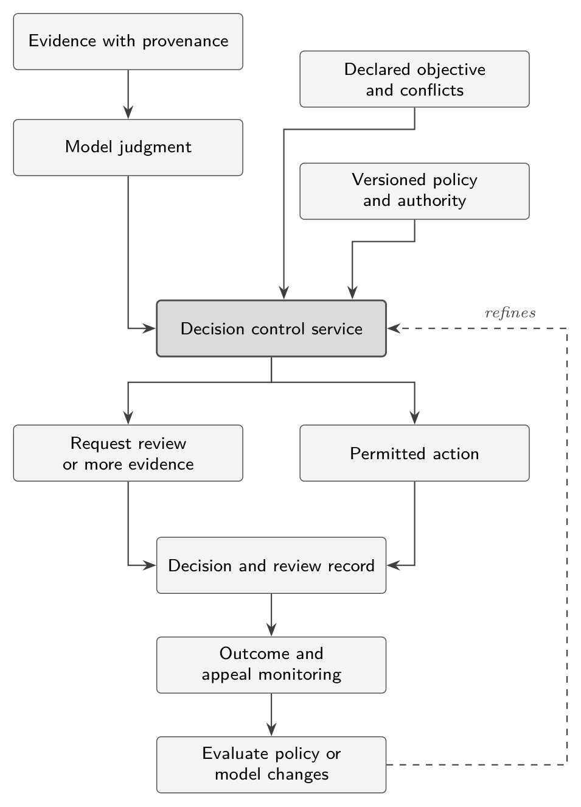
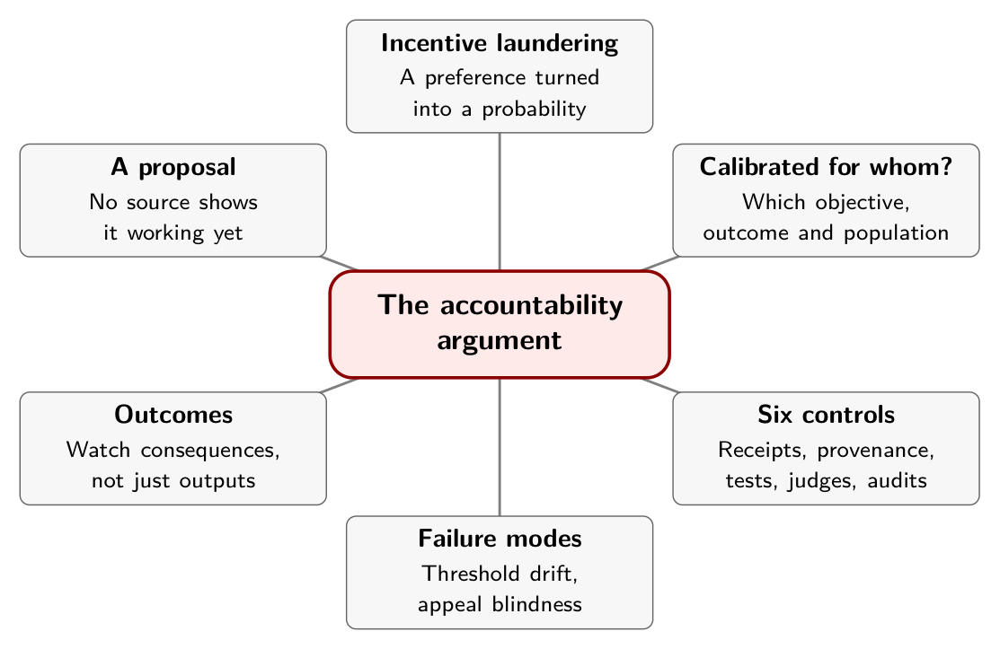

# Chapter 11. The Accountability Argument

Consider a travel-booking assistant that has to choose which hotel to put first. One is the best fit for the traveler. One pays a higher commission. One is a promoted partner. One is likely to generate fewer support calls. A decision model scores them, and the top-scoring hotel is shown.

Later, someone asks why the sponsored hotel keeps winning. The provider can truthfully say that the model was only 78 percent confident, that probabilistic systems sometimes err, that it weighed several signals, and that no explicit rule preferred the sponsored option.

This scenario is a hypothetical from the notes supplied for this book, not a report of any real system. Nothing I captured shows Jev, or any named provider, behaving this way, and the notes do not claim it. But the scenario names a real gap. The notes give that gap a name: *incentive laundering*, in which a commercial preference is turned into an apparently neutral model probability.[^ch11-1]

## Why decisions differ from text

A generative model's output is usually visible. Someone can read a generated report, challenge its claims, and blame it for errors. A decision model's output can vanish into code:

```python
if approval_probability > 0.8:
    approve_application()
```

The person affected may never see the model, the question, the alternatives or the threshold. They see the consequence. The notes put it in one line: generative AI can pollute content, and decision AI can silently alter outcomes.[^ch11-1b] A probability tells you what the model chose and how strongly. It does not tell you which evidence changed the outcome, which criteria applied, what was traded off, whether an interest was in play, or what would have flipped the result.

Speed and price make the pattern worse, because they make it practical to place hundreds of such judgments inside one workflow. A recruiting pipeline might decide separately whether a candidate is relevant, whether to request more evidence, which interview to offer, whether an inconsistency is suspicious, and whether rejection is certain enough. No single one looks consequential. Together they decide what happens to the candidate.

## Calibrated for whom?

Chapter 4 opened with two dashboards: equal accuracy, different costs. The notes add the sharper version. A model can be well calibrated and still disadvantage one subgroup, optimize the wrong business objective, ignore a rare but important factor, prefer a commercially favorable option, concentrate its harm in the 20 percent it gets wrong, or be correct against a biased definition of success.[^ch11-1c]

So the governance question cannot stop at whether the probabilities were calibrated. It has to ask: calibrated for whose objective, against which outcome, over which population, and at what cost when wrong?

## A proposed control layer

The notes propose a layer between the decision model and every system that can act on its output, which they call a *decision firewall*. I will call it a *decision control service*, because it is a proposal for application design and not a product I can point to. It has six capabilities.

**1. Decision receipts.** Every consequential decision creates a record: the model and version, the schema, the input facts and where they came from, the alternatives, the selected one, the probability distribution, the policy version, the threshold, who or what is accountable, whether a human could override it, and the eventual outcome. The notes call these receipts "immutable" and "replayable." Chapter 10 gives two reasons to soften that: a fingerprint is not an immutable log, and a hosted model may not replay bit for bit.

**2. Evidence provenance.** Distinguish observed facts, inferred facts, missing information, policy constraints, model judgments and commercial objectives. The notes are explicit that the audit target is *not* the model's chain of thought, which can be unreliable and manipulable. It is which declared evidence, rule, objective and threshold produced this executable outcome.[^ch11-1d]

**3. Counterfactual testing.** Re-run the decision while changing one factor at a time. Remove the sponsorship relationship. Supply the missing evidence. Change a protected attribute or a proxy. See how close the runner-up was and what minimal change would flip the result. Two cautions of mine: a changed outcome is a signal to investigate, not proof of misconduct, and arbitrary attribute swaps can produce implausible records, so they are sensitivity probes and not causal estimates.

**4. Independent shadow judges.** Do not let the provider that decides also certify its own decision. Run a deterministic policy engine for hard constraints, perhaps a second model from another provider, and a human path for material disagreement. Escalate on disagreement, expected harm and irreversibility, not on confidence alone. My caution: agreement is not a certificate, because two systems can share training sources, label biases or blind spots.

**5. Objective audits.** Each decision endpoint should declare what it optimizes: user value, revenue, conversion, cost, risk, compliance, or a stated weighting. A recommender that says "best option" while optimizing a blend of suitability, commission and supplier preference has an undisclosed objective function. The notes observe that the problem is often not a biased model but exactly that.

**6. Outcome monitoring.** Watch consequences, not only inputs and outputs. Who benefited, who was rejected, who appealed, which decisions were overturned, where the probabilities and outcomes diverged, whether a model update changed approval rates, whether sponsored items suddenly became more likely to win. If rejected opportunities never yield an observable outcome, the dataset has a selection problem and not a complete record of success. That is the notes' "appeal blindness" seen from the data side.

{alt="Flow diagram. Evidence with provenance feeds a model judgment. The model judgment, a declared objective and conflicts, and versioned policy and authority all feed a decision control service. The service either requests review or more evidence, or permits an action. Both paths write a decision and review record. The record feeds outcome and appeal monitoring, which feeds evaluation of policy or model changes."}

## What this doesn't establish

This layer is a *proposal*. The notes argue for it, and I find the argument coherent, but no source I captured shows it working, and it should be judged like any other design: by what it lets you test.

The NIST AI Risk Management Framework offers useful context. Its Core comprises four functions, govern, map, measure and manage, and says its actions "do not constitute a checklist." That places the proposal within a familiar way of thinking about risk. It is not a certification of this design.[^ch11-2] The notes also point to commercial governance products and to the EU's AI regulation as partial coverage of the same territory. I did not review either.

Two more of the notes' ideas need care. First, they offer a risk score, $R = I \times U \times V \times A$, multiplying impact, uncertainty, vulnerability to incentives and autonomy. Without defined scales and validation it is a brainstorming aid, not a metric, and I have not used it. Explicit action classes and non-negotiable policy checks, as in Chapter 10, are easier to inspect and to test. Second, the notes' list of what to anticipate is useful as a checklist of failure modes, provided it is read as a list of hypotheses.

## Failure modes worth watching for

The notes list ten. A few are close to what the earlier chapters measured, and the rest are worth a sentence each.[^ch11-1e]

- **Threshold laundering.** The model does not change, but the execution threshold moves from 0.85 to 0.61. Chapter 6 showed that a threshold means different things at different levels of confidence, so a quiet change can alter outcomes materially.
- **Selective invocation.** The model is called only when a favorable answer is expected.
- **Automation asymmetry.** Favorable decisions execute automatically and unfavorable ones receive scrutiny, or the reverse.
- **Appeal blindness.** The system learns from accepted decisions and never sees the true outcomes of rejected ones.
- **Proxy discrimination.** Protected attributes are removed, but location, language, employment gaps or device type recreate them.
- **False neutrality.** Structured probabilities look more scientific than prose, even where the underlying question is normative.
- **Responsibility diffusion.** The provider blames the deployment, the deployer blames the model, and the human reviewer blames the score.

The others are decision monoculture, objective drift and context poisoning. The last has a documented mechanism: TypeSafe's own jaggedness page says state is not treated as hostile by default and that text written to steer the answer can move it.[^ch11-3]

## In practice

- Name the objective of every decision endpoint, in writing, including any commercial interest. If you can't, that is the finding.
- Log receipts that let you answer "which evidence, rule, objective and threshold produced this," without reconstructing anything from memory.
- Run counterfactual and sensitivity tests on the factors that should not matter: sponsorship, irrelevant wording, missing evidence, likely proxies.
- Keep deterministic constraints and an accountable human path alongside any shadow judge.
- Monitor consequences and appeals, and record what you cannot observe.
- Treat threshold changes as policy changes, with owners, versions and review.

## Remember this

A neutral-looking probability can carry an objective nobody declared.

{alt="Mindmap. Center: The accountability argument. Branches: Incentive laundering (A preference turned into a probability); Calibrated for whom? (Which objective, outcome and population); Six controls (Receipts, provenance, tests, judges, audits); Failure modes (Threshold drift, appeal blindness); Outcomes (Watch consequences, not just outputs); A proposal (No source shows it working yet)."}

[^ch11-1]: Supplied notes, `jev.txt`, a document of analysis and product ideas about Jev and accountability (no web address; it was provided as a text file). The travel example, "incentive laundering," "Generative AI can pollute content. Decision AI can silently alter outcomes," the calibration questions, the six capabilities, the risk formula and the list of failure modes are all from it. They are proposals and hypotheses; the notes do not present evidence about any named provider.

[^ch11-2]: National Institute of Standards and Technology, "AI RMF Core," excerpt from the *AI Risk Management Framework 1.0* (2023), <https://airc.nist.gov/airmf-resources/airmf/5-sec-core/>. The Core "is composed of four functions: govern, map, measure, and manage," and its actions "do not constitute a checklist."

[^ch11-3]: TypeSafe AI, "Jev 1.13 jaggedness," documentation, reviewed September 17, 2026, <https://docs.typesafe.ai/model-jaggedness/jev-1.13.md>, "Adversarial content."

[^ch11-1b]: jev.txt, section "Why this creates a new category of risk."

[^ch11-1c]: jev.txt, section "Confidence can make this worse."

[^ch11-1d]: jev.txt, section "2. Evidence provenance."

[^ch11-1e]: jev.txt, section "Additional problems worth anticipating."
