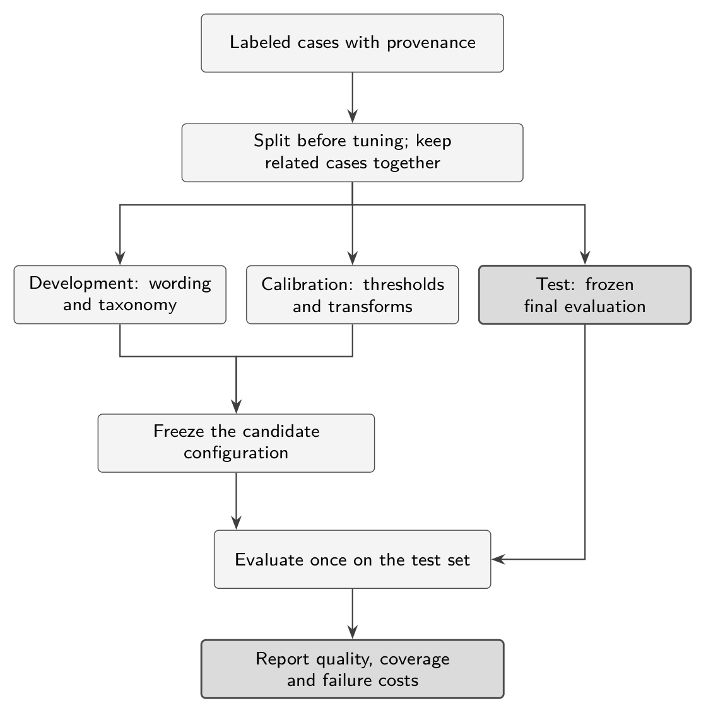
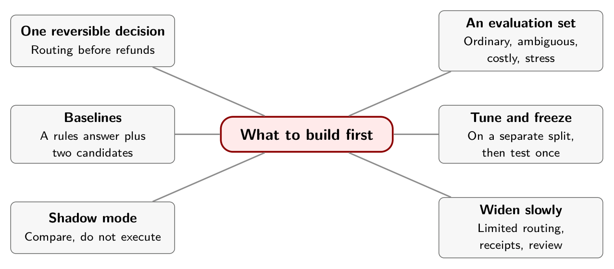

# Chapter 13. What to Build First

A team has been asked to "add AI" to its support workflow. The first proposal on the table is to let a model decide refunds. The second is to let it decide which queue a ticket goes to. Both are decision problems, both can be tried in an afternoon, and one of them can be undone by moving a ticket back.

Pick the reversible one. Below are seven steps for turning a decision model into a measured, bounded part of a system, using the tools from the earlier chapters.

## The sequence

**1. Choose one reversible decision.** Ticket routing is a better first experiment than moving money. Define what "other" means, what missing evidence looks like, and what happens on review, before any model is involved.

**2. Build an adjudicated evaluation set.** Four groups of cases belong in it. Representative ordinary tickets, sampled from real traffic. Ambiguous and missing-information cases. Rare but costly mistakes, deliberately oversampled so you can diagnose them. And stress cases: negation, contradictory evidence, injected instructions, unfamiliar topics, other languages, and permuted option order. Report production-weighted results separately from stress-suite results. An adversarially enriched suite misrepresents expected traffic, and an ordinary random sample can hide rare harm. Have domain reviewers settle the labeling policy before any model competes. Chapter 6's Archestra benchmark is the cautionary tale: a random sample was 90 percent routine, and its authors concluded the original benchmark was the thing that needed fixing.[^ch13-1]

{alt="Flow diagram. Labeled cases with provenance are split before tuning into three sets: development, for wording and taxonomy; calibration, for thresholds and transforms; and test, a frozen final evaluation. Development and calibration feed a frozen candidate configuration, which is evaluated once on the test set. The report covers quality, coverage and failure costs."}

**3. Run baselines and two candidates.** Include a rules or majority-class baseline, and at least two systems from Chapter 8 that differ in something you need to control. Record exact versions, question schemas, truncation, the full distributions and end-to-end timing.

**4. Tune thresholds and calibration on the calibration split.** Keep prompt and taxonomy work in the development split. Measure accepted error rates and review load across thresholds. If you add a fallback, validate it on the forwarded cases, as Chapter 7 showed. Freeze the threshold before the final run.

**5. Run in shadow mode.** Compare what the system proposes with what actually happened, and do not let the candidate execute anything.

**6. Enable limited routing with receipts.** Add rollback, rate limits, review capacity, policy ownership and protection against duplicate actions, using the policy shape of Chapter 10.

**7. Review outcomes before widening authority.** Model quality, policy quality and available evidence each need their own explanation. A bad result can come from any of the three.

## What to measure

One number won't do. Track several, each answering a different question.

| Metric | Why include it | Common mistake |
|---|---|---|
| Accuracy and the majority baseline | Does the model beat a trivial answer? | Ignoring class imbalance |
| Per-class precision, recall, confusion matrix | Which mistakes does it make? | Reporting only an average |
| Brier score or negative log likelihood | How good are the distributions, not only the winner? | Scoring the top label alone |
| Reliability bins and calibration error | Does the probability match outcomes? | Calling any `confidence` field a probability |
| Coverage and selective risk | How much is automated, and how often is that wrong? | High accepted accuracy without accepted volume |
| Latency and cost, over the whole workflow | What does the complete path consume? | Reporting only warm model time |
| Repeated and permuted inputs | How stable are decisions near the threshold? | Assuming a typed schema means repeatable answers |

Add uncertainty intervals, slices by class and subgroup where appropriate, outcomes for the reviewed and denied cases, and a threshold sweep chosen on the calibration data.

## Three exercises with the lab

The offline lab in `examples/` is a good place to try these before you touch real data.

1. Change the threshold and watch coverage and selective accuracy move. Find the threshold at which the confident wrong prediction stops routing, and see what else it costs you.
2. Insert a second confident wrong prediction and watch the calibration error and Brier score respond.
3. Request a refund action at probability 1.0 and confirm that it cannot route.

Then replace the synthetic predictions with a saved, labeled evaluation run, keeping the same policy and metrics contract.

## The deliverable

The point of the first build is not a working classifier. It is a measured operating boundary: which judgments this configuration handles, under what evidence and policy, with which residual errors. That boundary is the useful output, and so is the outcome that some cases must stay with people.

If you carry one idea out of this book, let it be this. A decision model gives your software a typed answer and a number. Whether the answer is right, whether the number means what you think, and whether anyone was entitled to act on it are three separate questions, and each of them is yours to answer, with evidence, in code.

## In practice

- Start with one reversible decision, and write down what "other", missing evidence and review mean.
- Split your data before you tune, and freeze the test set.
- Always run a baseline and compare it to at least two candidates.
- Run in shadow mode before the system may act, and add authority in steps.
- Report what the system does not handle, not only its accuracy.

## Remember this

The deliverable is a measured operating boundary, including what people keep.

::: {.center}

{alt="Mindmap. Center: What to build first. Branches: One reversible decision (Routing before refunds); An evaluation set (Ordinary, ambiguous, costly, stress); Baselines (A rules answer plus two candidates); Tune and freeze (On a separate split, then test once); Shadow mode (Compare, do not execute); Widen slowly (Limited routing, receipts, review)."}

:::

[^ch13-1]: Arseny Kravchenko, "We Tested Jev on 100 Real Agent Calls. How Easy Is It To Beat a Constant?," Archestra, September 21, 2026, <https://archestra.ai/blog/we-tested-jev-on-100-real-agent-calls>. The article reports that around 90 of 100 randomly sampled calls were routine and only about 10 covered the dangerous cases, and that this made the original benchmark "bad."
