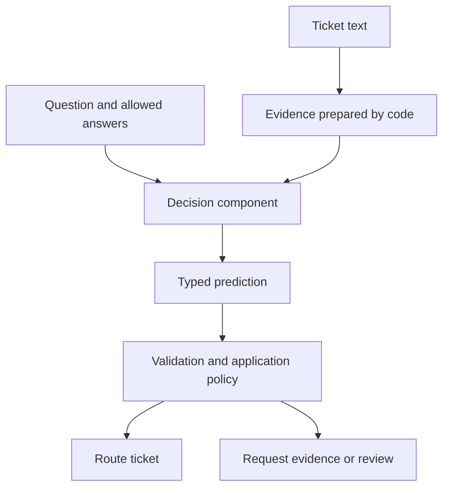
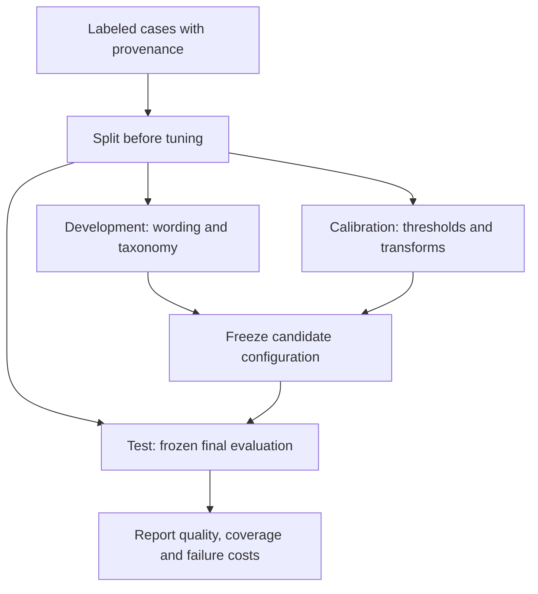
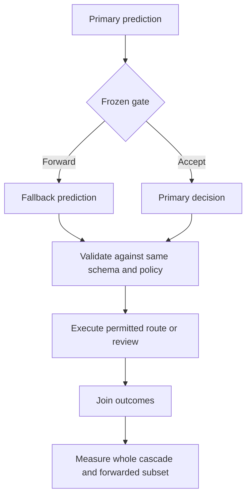
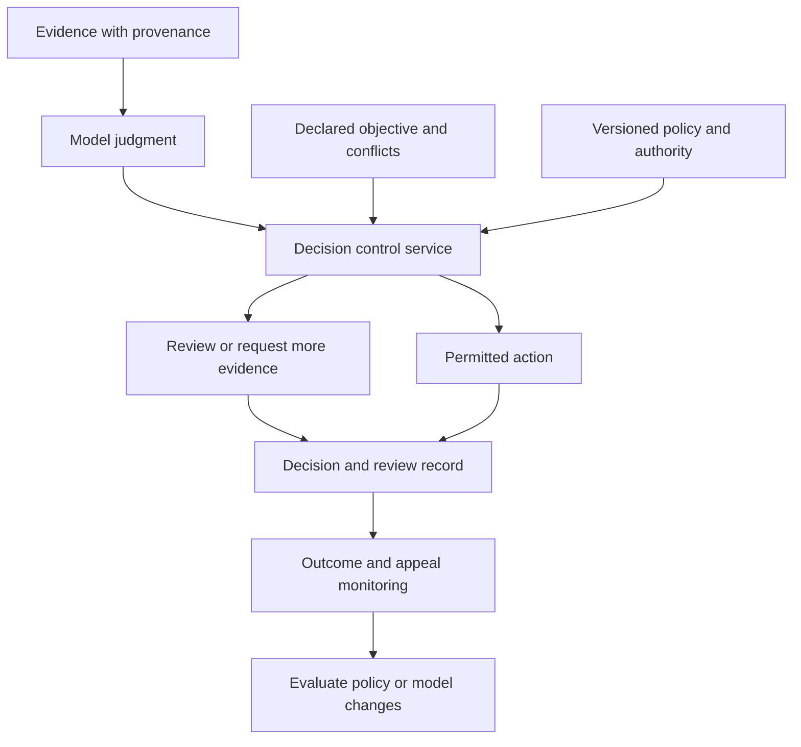
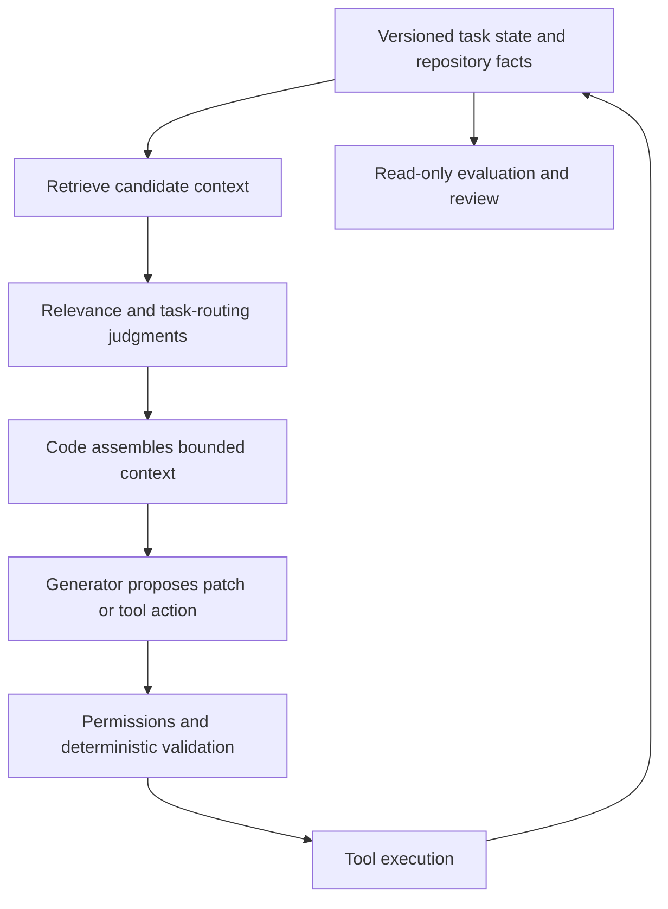

# Decision models: from a typed prediction to an accountable action

*A practical tutorial for Python developers, centered on Jev and several alternatives. Sources checked 26 September 2026.*

An application receives this message:

> “My invoice contains the same charge twice. Please refund the duplicate.”

Before writing a reply, the application needs to decide which queue owns the ticket, whether a refund was requested, and whether any action is authorized. Those are three different questions. We will keep them separate throughout this tutorial.

You will build a small decision workflow, learn to interpret its outputs, compare implementation families, measure mistakes, and design a boundary between a prediction and an action. The code includes an offline lesson that needs no API key and a separate optional Jev call. The examples and diagrams are original; empirical findings are attributed to their sources.

## 1. Start with the decision, not the model

For this tutorial, call a *decision model* a component that takes evidence and a defined question, then evaluates permitted answers. That is a functional definition, not a claim that every such component shares an architecture or training method.

For example, Jev's Choice primitive selects from options the caller supplies.[^c-001] A useful application contract might look like this:

```json
{
  "state": {"message": "My invoice contains the same charge twice."},
  "question": "Which team should handle this?",
  "options": ["billing", "technical", "other"]
}
```

This is a conceptual contract, not the Jev HTTP schema. A hypothetical result might assign `billing=0.90`, `technical=0.05` and `other=0.05`. Nothing in that result establishes that the charge was duplicated in the payment database. The customer has reported a problem; the application still needs to investigate it.



*Figure 1. Original tutorial diagram. The bounded choice contract is based on TypeSafe's [Choice documentation](https://docs.typesafe.ai/primitives/choice); the application boundary is our design.*

Before choosing a model, classify the work:

| Question | Starting implementation to test |
|---|---|
| Does the invoice total equal the sum of its line items? | Exact arithmetic in code |
| Does this message ask for a refund? | Semantic classifier or decision model |
| Which of our permitted queues best fits the request? | Rules baseline, then a decision model |
| What should a helpful reply say? | Template or generative model |
| May this account receive money? | Verified business facts and authorization policy, with any learned judgments kept explicit |

An LLM returning a constrained JSON label is a legitimate comparison baseline. Do not compare a carefully engineered decision API only against a deliberately fragile “please return JSON” prompt. Measure the alternatives your application would actually deploy.

The central boundary is **valid output versus correct interpretation**. TypeSafe attributes its zero-percent formatting figure to schema matching.[^c-006] That does not establish zero wrong choices. Its own Jev limitation page documents numerical, adversarial-input and consistency problems.[^c-007]

## 2. Learn the three Jev primitives

Use the current documentation for the contract, rather than copying SDK syntax out of article screenshots.

| Primitive | What to ask | What to inspect |
|---|---|---|
| Choice | Which one of these queues fits? | Selected option and distribution across options[^c-001] |
| Noul | Is a refund explicitly requested? | Probability that the answer is yes[^c-002] |
| Score | Which ordered urgency description fits? | Distribution across ordered rubric levels[^c-003] |

### Choice: describe the alternatives

Prefer criteria with operational meaning:

```python
criteria = {
    "billing": "Charges, invoices, payment disputes, or refunds",
    "technical": "Product faults or integration failures",
    "other": "Insufficient information or outside these categories",
}
```

Adding `other` gives the model a permitted way to represent taxonomy mismatch. It does not guarantee that every unfamiliar request will land there. Include unrelated and ambiguous tickets in the evaluation set.

Keep two issues separate: “the model found one option much better than the others” and “the available options adequately represent the situation.” A narrow answer set can make the former easy while the latter is false.

### Noul: preserve the number

A Noul is a probability of yes, not a Python Boolean.[^c-002] For illustration, `0.03` supports a different interpretation from `0.97`; both would become `True` if carelessly passed through Python's `bool()`.

Ask literal, testable questions. “Does the customer explicitly request a refund?” is narrower than “Should we refund?” The second folds customer intent, evidence, account verification, policy and execution authority into one opaque judgment.

### Score: define the rubric before using its average

Our urgency rubric will be:

1. No time pressure stated.
2. Time-sensitive issue without a stated outage.
3. Current service outage or inability to operate.

The SDK represents these as zero-based ordered levels and reports a probability-weighted expected score.[^c-010] With illustrative probabilities `[0.10, 0.30, 0.60]`, the expectation is:

$$
0(0.10) + 1(0.30) + 2(0.60) = 1.50.
$$

That is an index on our rubric. It is not a measured number of hours, a monetary loss, or proof that the real-world gaps between levels are equal. Keep the full distribution when different mixtures would require different actions.

## 3. Distinguish probabilities, confidence and calibration

For a categorical distribution, let `p_max` be the largest option probability. That is one signal you can evaluate. A provider's field named `confidence` is another.

TypeSafe derives Choice/Score confidence from the distribution; Noul has no separate confidence field.[^c-004] Do not interpret every provider's `confidence=0.9` as “90% of these decisions will be correct.” Laya explicitly warns that a confidence threshold ported from Jev does not transfer.[^c-014]

**Calibration is an empirical relationship.** Consider a hypothetical held-out set where 100 predictions have top probability close to `0.8`. If about 80 selected labels are correct, that group is consistent with top-label calibration. If only 55 are correct, it is overconfident on that group. Finite groups have sampling uncertainty, so a small discrepancy is not automatically meaningful. TypeSafe's own primer describes calibration over groups rather than a promise about one answer.[^c-005]

Now suppose two groups both have 80 correct predictions out of 100. In one, every error merely sends a ticket to the wrong queue. In the other, errors trigger unauthorized refunds. Their empirical accuracy is identical; our willingness to automate them should differ. Calibration informs a policy. It does not choose the policy's objective.

### Where RLHF, RLVR and RLCD fit

Use these as descriptions of objectives, not interchangeable labels:

| Term | Learning signal to understand | Evidence boundary |
|---|---|---|
| RLHF | Human feedback/preferences about outputs | InstructGPT is a primary research example.[^c-027] |
| RLVR | Rewards based on verifiable outcomes, such as checkable answers | Read this alongside reasoning-RL research such as DeepSeek-R1; it is not a calibration guarantee.[^c-028] |
| RLCD | TypeSafe's name for training aimed at calibrated decisions | Vendor-described approach; the full proprietary recipe was not reproduced here.[^c-005] |

The supplied notes group RLVR and RLCD together too closely. A reward for obtaining a correct result and a reward for representing uncertainty honestly target different properties. A training objective is also not evidence that calibration survives every distribution shift.

Recalibration is another distinct step. Temperature scaling is studied in the calibration literature.[^c-029] For strictly positive categorical probabilities, its algebra can be written:

$$
q_i = \frac{p_i^{1/T}}{\sum_j p_j^{1/T}}, \qquad T>0.
$$

Fit `T` on a separate labeled calibration set. At positive `T`, this transformation preserves the ranking; it changes sharpness, not the winner. Rounded or zero API probabilities complicate reconstructing the original distribution. Recalibration is not a way to recover missing evidence or repair a wrong ranking.

## 4. Make one documented Jev call

The optional example is [jev_triage.py](../examples/jev_triage.py). It uses the documented `system_one` method with named questions. The documented HTTP endpoint is `POST https://api.typesafe.ai/v1/systemone`.[^c-009]

Create a separate Python environment, install `typesafe-sdk==0.7.1` (the captured [Python changelog](https://docs.typesafe.ai/sdk/python/changelog) documents this release), set `TYPESAFE_API_KEY` through your environment, and run:

```text
python examples/jev_triage.py
```

The key portion is:

```python
from typesafe_sdk import Choice, Noul, Score, TypeSafeClient

questions = {
    "team": Choice(
        instructions="Choose the team best suited to this ticket.",
        criteria={
            "billing": "Charges, invoices, or refunds",
            "technical": "Product faults or integration failures",
            "other": "Missing information or outside these categories",
        },
    ),
    "refund_requested": Noul(
        instructions="Does the message explicitly request a refund?"
    ),
    "urgency": Score(instructions="Rate urgency from stated facts.", criteria=[
        "No time pressure stated",
        "Time-sensitive issue without a stated outage",
        "Current service outage or inability to operate",
    ]),
}

with TypeSafeClient(model="jev-1.13.0", timeout=20.0) as client:
    result = client.system_one(
        state={"message": "Please refund the duplicate invoice charge."},
        questions=questions,
    )

print(result.choices["team"].probabilities)
print(result.nouls["refund_requested"].noul)
print(result.scores["urgency"].score)
```

The complete file supplies more precise instructions and explicitly stops before any account action. The API shape was checked against captured documentation and the Python source was syntax-checked. The SDK was not installed here, and no live API request was made during preparation.

Two maintenance details matter. The Python SDK changed Score criteria to an ordered sequence in version 0.6.0.[^c-011] TypeSafe also recommends pinning the model version after tuning thresholds, because aliases can move.[^c-008] Record the SDK version, returned model identifier, question schema and policy version together when you evaluate an integration.

For application deployment, add timeout/error handling that routes to review, input minimization, retry limits, observability and an idempotent action handler. The small example demonstrates the call contract; it is not a production service.

## 5. Compare approaches beneath similar interfaces

Select comparison candidates by what you need to control: the hosted service, model weights, runtime, labels, calibration procedure or application policy. A familiar request shape does not make outputs or thresholds interchangeable.

| Candidate | Distinction worth investigating | First question for your evaluation |
|---|---|---|
| Jev / TypeSafe | Hosted typed-decision interface | Does its uncertainty signal separate acceptable automation from review on our tickets? |
| Laya | Encoder checkpoints with task specialization | Which checkpoint and input/option budgets actually match our workload? |
| Decision 1.0 | Family spanning encoder and adapted Qwen branches | Which release/runtime fits our evidence length and latency constraints? |
| GLiNER2.5-Decide | Schema-driven classification with related structured capabilities | Do we need multi-label decisions, extraction or cross-output constraints? |
| AnyJev | Readout/debiasing/calibration toolkit around an existing LLM | Can we improve our existing model's decision interface without confusing debiasing with calibration? |
| SemIf | Option-conditioned readout plus workload calibration support | How do option wording, ordering and calibration data change results? |

**Laya:** the current repository distinguishes base checkpoints from a specialized typed-decisions checkpoint, and describes near-chance base performance on its typed-decisions evaluation.[^c-015] That is a reason to check the exact checkpoint, not to declare every Laya use ineffective. Its confidence semantics require separate threshold validation.[^c-014] The supplied Doom article is a useful harness-design story, not a general accuracy benchmark.

**Decision 1.0:** the captured release describes encoder and adapted Qwen branches. It also says native vLLM-SR integration and Open Decision API support are planned next.[^c-019] Do not turn a roadmap into an installation claim. Its release benchmark should remain attached to its own selected task suite, runtime and weighting.

**GLiNER2.5-Decide:** its model card identifies a 340M English classification model.[^c-016] Fastino's release also describes structured extraction and constraints, but explicitly says classification answers themselves do not return evidence spans.[^c-021] Requesting an extraction task is different from receiving a causal explanation for every classification. Another crucial naming correction: the release says JevK5 is an open reproduction, not TypeSafe Jev.[^c-020] Its leaderboard cannot be retold as “GLiNER beat Jev.”

**AnyJev:** L0 debiasing does not by itself establish calibrated uncertainty; the documented L1 calibration has a distribution-shift boundary.[^c-012][^c-013] Treat the project as a toolkit with multiple levels, not as one pretrained checkpoint or a promise that no fitting is ever involved.

**SemIf:** returned distributions are conditional on the supplied options.[^c-017] Its current repository includes workload-specific calibration, which leaves the selected option unchanged.[^c-018] Older descriptions calling the entire project uncalibrated are incomplete.

For a fair application comparison, fix the cases and labeling policy first. Let each system use its supported interface, but record differences in prompts, candidates, truncation, quantization, hardware and retries. Run a rules or majority-class baseline alongside them. There is no universal winner established by this research pack.

## 6. Build an evaluation before increasing automation

Our suggested dataset design has four groups:

- Representative ordinary tickets, sampled from the intended traffic.
- Ambiguous and missing-information cases.
- Rare but costly mistakes, deliberately oversampled for diagnostic testing.
- Stress cases: negation, contradictory evidence, injected instructions, unfamiliar topics, languages and option permutations.

Keep production-weighted results separate from stress-suite results. Otherwise, an adversarially enriched suite can misrepresent expected traffic, while an ordinary random sample can hide rare harm. Have domain reviewers resolve the labeling policy before asking models to compete.



*Figure 2. Original tutorial evaluation protocol. Keep related cases together when splitting, and use a later time period when testing temporal generalization.*

Track multiple outcomes:

| Metric | Why include it? | Common mistake |
|---|---|---|
| Accuracy and majority baseline | Does the model improve on a trivial choice? | Ignoring class imbalance |
| Per-class precision/recall and confusion matrix | Which mistakes does it make? | Reporting only an average |
| Brier score / negative log likelihood | How good are the distributions? | Evaluating only the winning label |
| Reliability bins / calibration error | Does the chosen probability signal match outcomes? | Calling any `confidence` field a probability |
| Coverage and selective risk | How much work is automated, and how often is that work wrong? | Reporting high accepted accuracy without accepted volume |
| Latency distribution and cost | What does the complete workflow consume? | Reporting only warm model compute time |
| Repeated and permuted inputs | How stable is the decision near the policy boundary? | Assuming repeatability from a typed schema |

Archestra's report used 337 judge-agreed decisions from an initial 400-label, 100-call sample.[^c-022] It reports mostly stable Jev labels alongside drifting probabilities and some sensitivity to option order.[^c-023] Those findings motivate stress tests; they do not establish behavior on every workload or current version. Judge agreement is also an operational reference, not infallible ground truth.

### Run the offline metrics lesson

```text
python examples/decision_workflow.py
python -m unittest discover -s examples -p "test_*.py" -v
```

The script uses six explicitly synthetic probability distributions. It implements:

$$
\text{Brier} = \frac{1}{N}\sum_{i=1}^{N}\sum_{k=1}^{K}(p_{ik}-y_{ik})^2
$$

and top-label expected calibration error:

$$
\text{ECE} = \sum_b \frac{|B_b|}{N}
\left|\operatorname{accuracy}(B_b)-\operatorname{meanTopProbability}(B_b)\right|.
$$

Here `y` is one-hot. The Brier convention sums over classes and averages over cases; some libraries use different normalization. The implementation clips probabilities only inside the logarithm when computing negative log likelihood. ECE depends on binning and is descriptive, especially for tiny samples.

In this constructed dataset, five of six top labels are correct. A probability-only cutoff of `0.8` would accept four cases, three correct. Our policy also sends `other` to review, so only three cases automatically route, and one of those three is wrong. This is intentionally a counterexample to assuming that a threshold improves accepted accuracy. It says nothing about Jev's performance.

For real data, add uncertainty intervals, class/subgroup slices where appropriate, denied/reviewed-case outcomes, and a threshold sweep chosen on calibration data. Freeze the threshold before final test evaluation.

## 7. Test the fallback on the cases it will actually receive

It is tempting to route uncertain cases to a larger model and assume quality improves. Instead, compare the two models on exactly those forwarded cases.

Let `S` be the subset the gate forwards. The quality question is:

$$
\operatorname{Accuracy}(\text{fallback}\mid S)
> \operatorname{Accuracy}(\text{primary}\mid S)?
$$

The fallback's overall benchmark score does not answer that conditional question. Its failures can overlap the primary model's difficult cases.

In the supplied Banking77 article, Nhu Hoang reports that routing Jev answers below the exact-1.00 confidence split to the tested Qwen configuration fixed 84 errors but introduced 211.[^c-024] This is one author-reported experiment, not a reproduced result here or proof that cascades generally fail. Its value is the test it suggests: count both corrected and newly introduced mistakes.



*Figure 3. Original tutorial diagram. The gate changes the population seen by the fallback.*

For a sequential fallback design, a simple expected-cost model is:

$$
C = C_{primary} + q C_{fallback} + C_{retrieval} + C_{policy} + C_{handoff},
$$

where `q` is the forwarded fraction. Add human review, retries and infrastructure when relevant. A lower per-call model price does not automatically yield a cheaper completed workflow. End-to-end latency also needs its own measurement; a serial forwarded request pays for both model calls.

## 8. Put an explicit policy between prediction and action

The offline lab's policy deliberately authorizes only queue routing. A refund request can have probability `1.0` while the policy still requires review for a refund action. This distinction is enforced by code and covered by a test.

The order is intentional:

1. Validate label membership, finite probabilities and a normalized distribution.
2. Check that required evidence exists.
3. Check whether the action is in the permitted automatic-action class.
4. Handle ties, `other`, and uncertainty.
5. Produce a routing proposal or a review outcome.

The code does not perform external side effects. Its `0.8` threshold is a teaching parameter, not a recommended production cutoff. Even after a policy permits an action, a real executor needs current authorization, business invariants and duplicate-action protection. Recheck relevant state at execution time so a stale decision cannot bypass a changed condition.

For high-impact applications, define review requirements independently of confidence. A high score should not override an absent mandate, missing evidence or an explicit prohibition. If the model call times out or its response fails validation, the workflow needs a defined non-executing path.

## 9. Turn the concerns in jev.txt into testable controls

The notes raise an important hypothetical: a system could optimize for commercial interests while presenting its output as neutral. This is a threat model to examine, not an allegation supported here about any named model provider.

We will call the proposed application layer a **decision control service**. It records why an action was allowed, checks policy, and observes outcomes. NIST's AI RMF Core groups risk work under Govern, Map, Measure and Manage; that provides context, not certification of this proposed design.[^c-026]



*Figure 4. Original proposed architecture inspired by the supplied concerns. This is application design, not a claimed Jev feature.*

### Record the decision without pretending to explain hidden reasoning

A production receipt should identify the question/schema, model/version, available alternatives, evidence references, probability distribution, threshold signal/value, policy version, execution authority, conflict disclosures, review path and eventual outcome.

The example's receipt is deliberately smaller. It includes an input fingerprint, prediction and policy result. **A hash is not an immutable log.** Immutability would require additional storage controls and access policy. A fingerprint alone cannot reconstruct the evidence, and retaining evidence needs privacy-aware access and retention rules. Replaying inputs to a hosted service also does not guarantee bit-identical outputs.

An evidence record answers “what was available and which rule permitted execution?” It should not be presented as the model's private chain of reasoning or a causal explanation of its internals.

### Evaluate incentives, sensitivity and disagreement

For a recommendation task, declare whether the objective is user suitability, revenue, support cost, or an explicit combination. Design paired tests that vary a sponsorship field while holding legitimate relevance facts fixed. A changed outcome is a signal to investigate, not proof of undisclosed misconduct.

Use similarly careful tests for irrelevant wording, missing evidence and demographic proxies. Arbitrary attribute swaps may produce implausible records; they are sensitivity probes, not automatically causal fairness estimates.

A shadow model can reveal disagreement, but agreement is not a certificate. Two systems may share training sources, label biases or blind spots. Keep deterministic constraints and an accountable review process alongside shadow judgments.

Finally, monitor consequences: reversals, appeal outcomes, delayed failures, review volume, subgroup error concentrations and changes after a model or threshold update. Track what is unknown. If rejected opportunities never receive an observable outcome, the dataset has a selection problem rather than a complete record of success.

Do not turn the notes' proposed `impact × uncertainty × incentives × autonomy` formula into an authoritative risk score. Without defined scales and validation, it is a brainstorming aid. Explicit action classes and non-negotiable policy checks are easier to inspect and test.

## 10. Extend the pattern to coding agents

The supplied coding-agent PDF identifies itself as an independent synthesis, not a TypeSafe publication.[^c-025] Its context-selection and routing ideas are useful advanced design proposals. Treat its illustrative cost and token-share figures accordingly.

Consider an agent investigating a failing test. Our proposed workflow might retrieve file candidates, ask a decision component which are relevant, assemble a bounded context, and route the task to a suitable model. Tool execution remains behind explicit permissions.



*Figure 5. Original proposed agent design. The source of inspiration is the independent [coding-agent study](../archive/Jev-Engineering-for-Coding-Agents.pdf), not copied artwork.*

Test whether context filtering preserves the evidence needed for the final task. Keep binding instructions and unresolved constraints outside discretionary relevance pruning. Choosing a tool also does not supply arbitrary valid arguments; extraction or generation still needs validation.

Measure routing at workflow level. A symbolic comparison is:

$$
C_{routed} = C_{router} + C_{helper\ input} + C_{helper\ output}
+ C_{handoff} + C_{parent\ reread}.
$$

Compare that with the direct path under the same success criterion. Cache reuse, prefix changes, summaries and repeated handoffs can change the result. Use observed token accounting and latency rather than importing someone else's list-price calculation.

LangChain's supplied [Jev and LangGraph article](https://www.langchain.com/blog/building-prod-with-jev-and-langgraph) is further reading for orchestration. The tutorial's next implementation exercise would make classification, policy, review and execution separate graph nodes, then test interruption and resumption without repeating a side effect.

## 11. A practical sequence for the next build

1. **Choose one reversible decision.** Ticket routing is a better first experiment than moving money. Define `other`, missing evidence and review behavior.
2. **Create an adjudicated evaluation set.** Keep development, calibration and final test cases separate; include costly edge cases as a named stress suite.
3. **Run baselines and two candidates.** Record exact versions, question schemas, truncation, full distributions and end-to-end timing.
4. **Tune thresholds and probability calibration on calibration data.** Keep prompt and taxonomy development in the development split. Measure accepted error rates and review load across thresholds. Validate any fallback on forwarded cases.
5. **Run in shadow mode.** Compare proposed actions with actual handling, without allowing the candidate to execute them.
6. **Enable limited routing with receipts.** Add rollback, rate limits, review capacity, policy ownership and duplicate-action protection.
7. **Review outcomes before widening authority.** Model quality, policy quality and available evidence each need their own explanation.

Try three exercises with the offline lab: change the threshold and inspect coverage; insert a confident wrong prediction and observe calibration metrics; request a refund action and confirm that probability cannot bypass policy. Then replace the synthetic predictions with a saved, labeled evaluation run while keeping the same policy and metrics contract.

The purpose of the next build is to establish a measured operating boundary: which judgments this configuration handles, under what evidence and policy, with which residual errors. That boundary is the useful deliverable, even when the correct result is that some cases must stay with people.

## What was and was not validated

The local lab ran successfully and six tests passed. They cover high-probability unauthorized actions, missing evidence, malformed distributions, ties, hand-calculated metrics and zero coverage. The optional Jev example was syntax-checked, not live-tested; its SDK was not installed in this workspace. No model weights were downloaded and no vendor benchmark was reproduced.

All five supplied PDFs and four required web links were captured. OCR-derived experiment numbers remain attributed and should be checked against original pages before creating a published quantitative chart. Company images were not embedded; all diagrams are new tutorial compositions. See the [research synthesis](../.research/synthesis.md), [learning plan](plan.md), and [asset policy](assets.md) for provenance and remaining gaps.

## References

[^c-001]: Choice selects one option from a caller-defined set. - [TypeSafe documentation: primitives/choice](https://docs.typesafe.ai/primitives/choice.md). Accessed 2026-09-26; T2. Evidence: s-006 in the [source ledger](../.research/sources.jsonl).

[^c-002]: Noul returns the probability of yes. - [TypeSafe documentation: primitives/noul](https://docs.typesafe.ai/primitives/noul.md). Accessed 2026-09-26; T2. Evidence: s-008 in the [source ledger](../.research/sources.jsonl).

[^c-003]: Score uses ordered descriptive levels. - [TypeSafe documentation: primitives/score](https://docs.typesafe.ai/primitives/score.md). Accessed 2026-09-26; T2. Evidence: s-007 in the [source ledger](../.research/sources.jsonl).

[^c-004]: TypeSafe confidence is derived from the output distribution; Noul has no separate confidence field. - [TypeSafe documentation: confidence](https://docs.typesafe.ai/confidence.md). Accessed 2026-09-26; T2. Evidence: s-009 in the [source ledger](../.research/sources.jsonl).

[^c-005]: TypeSafe calls its decision-training approach RLCD and describes calibration over groups, not a guarantee about one prediction. - [TypeSafe documentation: introduction/machine-learning-primer](https://docs.typesafe.ai/introduction/machine-learning-primer.md). Accessed 2026-09-26; T2. Evidence: s-010 in the [source ledger](../.research/sources.jsonl).

[^c-006]: TypeSafe attributes its zero-percent figure to schema matching, not empirical task correctness. - [Introducing System One Models and Jev](https://typesafe.ai/blog/introducing-system-one-models-and-jev). Accessed 2026-09-26; T4. Evidence: s-004 in the [source ledger](../.research/sources.jsonl).

[^c-007]: TypeSafe documents numerical, adversarial-input and cross-question consistency limitations for Jev 1.13. - [TypeSafe documentation: model-jaggedness/jev-1.13](https://docs.typesafe.ai/model-jaggedness/jev-1.13.md). Accessed 2026-09-26; T2. Evidence: s-011 in the [source ledger](../.research/sources.jsonl).

[^c-008]: TypeSafe advises pinning a version after tuning thresholds because aliases can move. - [TypeSafe documentation: models](https://docs.typesafe.ai/models.md). Accessed 2026-09-26; T2. Evidence: s-014 in the [source ledger](../.research/sources.jsonl).

[^c-009]: The documented Jev HTTP endpoint is POST https://api.typesafe.ai/v1/systemone. - [TypeSafe documentation: introduction/quickstart](https://docs.typesafe.ai/introduction/quickstart.md). Accessed 2026-09-26; T2. Evidence: s-005 in the [source ledger](../.research/sources.jsonl).

[^c-010]: The SDK Score answer reports a probability-weighted expected rubric score. - [TypeSafe documentation: sdk/python/api/types/responses](https://docs.typesafe.ai/sdk/python/api/types/responses.md). Accessed 2026-09-26; T2. Evidence: s-012 in the [source ledger](../.research/sources.jsonl).

[^c-011]: Python SDK version 0.6.0 changed Score criteria to an ordered sequence. - [TypeSafe documentation: sdk/python/changelog](https://docs.typesafe.ai/sdk/python/changelog.md). Accessed 2026-09-26; T2. Evidence: s-015 in the [source ledger](../.research/sources.jsonl).

[^c-012]: AnyJev L0 debiasing alone does not establish calibrated model uncertainty. - [AnyJev decision levels](https://raw.githubusercontent.com/nokia-applied-research/AnyJev/main/docs/levels.md). Accessed 2026-09-26; T1. Evidence: s-021 in the [source ledger](../.research/sources.jsonl).

[^c-013]: AnyJev warns its L1 calibration does not generally survive distribution shift beyond its calibration set. - [AnyJev decision levels](https://raw.githubusercontent.com/nokia-applied-research/AnyJev/main/docs/levels.md). Accessed 2026-09-26; T1. Evidence: s-021 in the [source ledger](../.research/sources.jsonl).

[^c-014]: Laya documents that a Jev confidence threshold does not transfer directly. - [Laya repository README](https://raw.githubusercontent.com/NandhaKishorM/laya/main/README.md). Accessed 2026-09-26; T1. Evidence: s-022 in the [source ledger](../.research/sources.jsonl).

[^c-015]: Laya distinguishes near-chance base-checkpoint typed-decisions performance from its specialized checkpoint. - [Laya repository README](https://raw.githubusercontent.com/NandhaKishorM/laya/main/README.md). Accessed 2026-09-26; T1. Evidence: s-022 in the [source ledger](../.research/sources.jsonl).

[^c-016]: GLiNER2.5-Decide is documented as a 340M English classification model. - [GLiNER2.5-Decide model card](https://huggingface.co/fastino/GLiNER2.5-Decide/raw/main/README.md). Accessed 2026-09-26; T2. Evidence: s-023 in the [source ledger](../.research/sources.jsonl).

[^c-017]: SemIf probabilities are conditional on the provided options. - [SemIf repository README](https://raw.githubusercontent.com/TheoLeeCJ/SemIf/master/README.md). Accessed 2026-09-26; T1. Evidence: s-024 in the [source ledger](../.research/sources.jsonl).

[^c-018]: SemIf includes workload-specific calibration which leaves the selected option unchanged. - [SemIf repository README](https://raw.githubusercontent.com/TheoLeeCJ/SemIf/master/README.md). Accessed 2026-09-26; T1. Evidence: s-024 in the [source ledger](../.research/sources.jsonl).

[^c-019]: Decision 1.0 provides encoder and adapted Qwen branches; native vLLM-SR integration is described as planned in its release. - [Introducing Decision 1.0](https://vllm-sr.ai/blog/decision-models/). Accessed 2026-09-26; T4. Evidence: s-002 in the [source ledger](../.research/sources.jsonl).

[^c-020]: Fastino explicitly distinguishes its JevK5 benchmark comparator from TypeSafe Jev. - [GLiNER2.5-Decide release](https://fastino.ai/blog/gliner-2-5-decide-open-weight-decision-model). Accessed 2026-09-26; T4. Evidence: s-033 in the [source ledger](../.research/sources.jsonl).

[^c-021]: Fastino says classification answers themselves do not include evidence spans. - [GLiNER2.5-Decide release](https://fastino.ai/blog/gliner-2-5-decide-open-weight-decision-model). Accessed 2026-09-26; T4. Evidence: s-033 in the [source ledger](../.research/sources.jsonl).

[^c-022]: Archestra reports 337 judge-agreed decisions from an initial 400-label, 100-call sample. - [We Tested Jev on 100 Real Agent Calls](https://archestra.ai/blog/we-tested-jev-on-100-real-agent-calls). Accessed 2026-09-26; T3. Evidence: s-020 in the [source ledger](../.research/sources.jsonl).

[^c-023]: Archestra reports mostly stable Jev labels but drifting probabilities and some option-order sensitivity. - [We Tested Jev on 100 Real Agent Calls](https://archestra.ai/blog/we-tested-jev-on-100-real-agent-calls). Accessed 2026-09-26; T3. Evidence: s-020 in the [source ledger](../.research/sources.jsonl).

[^c-024]: In Nhu Hoang's supplied Banking77 experiment, retaining Jev answers at confidence exactly 1.00 and routing the rest to Qwen fixed 84 errors but introduced 211. - [Nhu Hoang: Jev vs. LLMs (supplied PDF pp. 20-22)](https://towardsdatascience.com/jev-vs-llms-when-ai-moves-from-generation-to-decision-making/). Accessed 2026-09-26; T4. Evidence: s-027 in the [source ledger](../.research/sources.jsonl).

[^c-025]: The coding-agent PDF labels itself an independent synthesis rather than an official TypeSafe publication. - [Jev-Engineering-for-Coding-Agents (supplied file)](../archive/Jev-Engineering-for-Coding-Agents.pdf). Accessed 2026-09-26; T4. Evidence: s-028 in the [source ledger](../.research/sources.jsonl).

[^c-026]: NIST AI RMF Core groups activities into Govern, Map, Measure and Manage. - [AI RMF Core](https://airc.nist.gov/airmf-resources/airmf/5-sec-core/). Accessed 2026-09-26; T1. Evidence: s-019 in the [source ledger](../.research/sources.jsonl).

[^c-027]: InstructGPT research describes fine-tuning from human feedback. - [Training language models to follow instructions with human feedback](https://arxiv.org/abs/2203.02155). Accessed 2026-09-26; T1. Evidence: s-017 in the [source ledger](../.research/sources.jsonl).

[^c-028]: The DeepSeek-R1 paper describes reinforcement learning for reasoning. - [DeepSeek-R1: Incentivizing Reasoning Capability in LLMs via Reinforcement Learning](https://arxiv.org/abs/2501.12948). Accessed 2026-09-26; T1. Evidence: s-018 in the [source ledger](../.research/sources.jsonl).

[^c-029]: Guo et al. study neural-network probability calibration and temperature scaling. - [On Calibration of Modern Neural Networks](https://proceedings.mlr.press/v70/guo17a.html). Accessed 2026-09-26; T1. Evidence: s-016 in the [source ledger](../.research/sources.jsonl).
